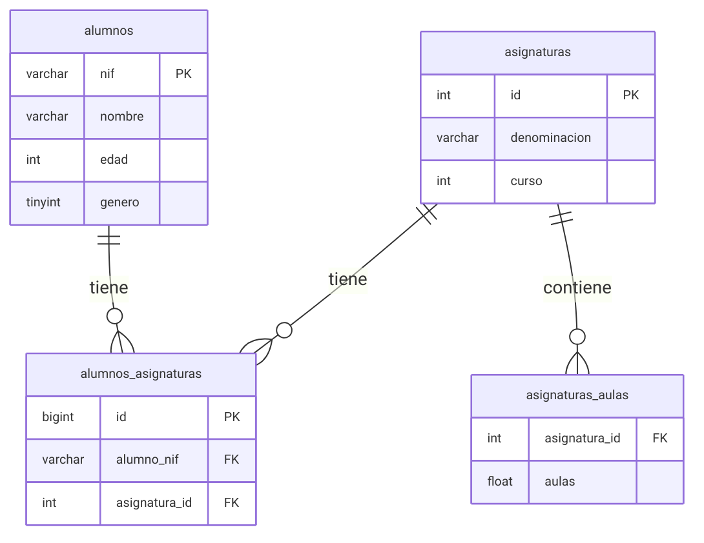
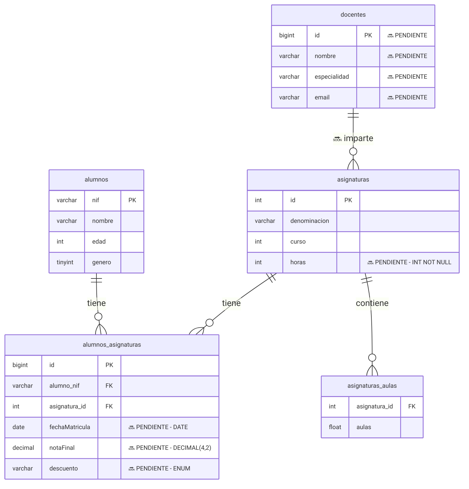

# SpringBoot y Angular(BS)
--------------

[//]: # (version: 1.0)
[//]: # (author: Iván Rodríguez)
[//]: # (date: 2025-07-30)


# Tabla de contenidos
- [SpringBoot y Angular(BS)](#springboot-y-angularbs)
- [Tabla de contenidos](#tabla-de-contenidos)
  - [Introducción](#introducción)
  - [Instalación](#instalación)
  - [FASE 1 - Crear Proyecto y configurar conexión BBDD](#fase-1---crear-proyecto-y-configurar-conexión-bbdd)
    - [Paso1. Crear proyecto con Spring Initializr en VS Code](#paso1-crear-proyecto-con-spring-initializr-en-vs-code)
    - [Paso2. Configurar aplicación y conectar con BBDD](#paso2-configurar-aplicación-y-conectar-con-bbdd)
  - [FASE 2 - Entidades, repositorios y datos iniciales](#fase-2---entidades-repositorios-y-datos-iniciales)
    - [Paso 3. Crear entidades (modelo)](#paso-3-crear-entidades-modelo)
    - [Paso 4. Ejecutar la aplicación y crear las tablas](#paso-4-ejecutar-la-aplicación-y-crear-las-tablas)
    - [Paso 5. Creamos los repositorios para todas las entidades.](#paso-5-creamos-los-repositorios-para-todas-las-entidades)
    - [Paso 6. Ahora vamos a introducir unos datos iniciales de prueba en la BBDD.](#paso-6-ahora-vamos-a-introducir-unos-datos-iniciales-de-prueba-en-la-bbdd)
  - [FASE 3: API REST Básico - Instalar Swagger/Postman](#fase-3-api-rest-básico---instalar-swaggerpostman)
    - [3.1. Crear Controlador API REST básico para Alumnos](#31-crear-controlador-api-rest-básico-para-alumnos)
    - [3.2. Instalación de Postman](#32-instalación-de-postman)
    - [3.3. Instalación de Swagger (Springdoc OpenAPI v3)](#33-instalación-de-swagger-springdoc-openapi-v3)
    - [3.4. Ampliando API REST](#34-ampliando-api-rest)
  - [FASE 4: FRONT END con Angular y Bootstrap](#fase-4-front-end-con-angular-y-bootstrap)
    - [4.1. Instalar Angular](#41-instalar-angular)
    - [4.2. Crear proyecto FrontEnd](#42-crear-proyecto-frontend)
    - [4.3. El MVC para Alumnos y Asignaturas](#43-el-mvc-para-alumnos-y-asignaturas)
      - [4.3.1 Modelos en Angular](#431-modelos-en-angular)
      - [4.3.2 Servicios en Angular](#432-servicios-en-angular)
      - [4.3.3 Vista de Consulta en Angular](#433-vista-de-consulta-en-angular)
    - [4.4 CORS](#44-cors)
    - [4.5 Resto de Endpoints en Angular](#45-resto-de-endpoints-en-angular)
      - [4.5.1. Ampliación del Servicio](#451-ampliación-del-servicio)
      - [4.5.2. Ampliación de la vista](#452-ampliación-de-la-vista)
  - [FASE 5: AMPLIAR PROYECTO: Asignaturas](#fase-5-ampliar-proyecto-asignaturas)
    - [5.1: Backend para asignaturas](#51-backend-para-asignaturas)
    - [5.2: Frontend para asignaturas](#52-frontend-para-asignaturas)
    - [Subapartado](#subapartado)
    - [Citas Coloreadas](#citas-coloreadas)


<div style="page-break-after: always;"></div>


## Introducción

<span class="emoji-heading"></span>

<p class="toc-link"><a href="#tabla-de-contenidos">Tabla de contenidos</a></p>


En estos apuntes vamos a ver un ejemplo completo y práctico en fases de un CRUD completo con SpringBoot.
Vamos a usar las siguientes tecnologías:

🧱 Stack 
- Java25 (Temurin)
- SpringBoot 3.5.11 con Maven
- Spring Data JPA (con Hibernate como proveedor JPA por defecto)
- Lombok (biblioteca que reduce boilerplate -código repetitivo- en Java; generando: setters/getters, constructores, etc)
- Angular 17 (la actual es el 21)
- Bootstrap 5.3.8
- Swagger 2.8.16
- Visual Studio Code (IDE)
- MYSQL8.4 (SGBD)
---

- [Documentación oficial Spring Boot 3.5](https://docs.spring.io/spring-boot/3.5/reference/index.html)
- [Documentación oficial Angular 21](https://angular.dev/docs)

Diagrama Entidad-Relación del modelo de datos (inicial)





Diagrama Entidad-Relación del modelo de datos (terminado)





<div style="page-break-after: always;"></div>

## Instalación 

<span class="emoji-heading"></span>

<p class="toc-link"><a href="#tabla-de-contenidos">Tabla de contenidos</a></p>


<div class="callout-important"></div>

> [!IMPORTANT]  
> La carpeta principal del proyecto será CrudSpringBoot. Daremos por sentado que está en ~, es decir el home o carpeta personal del usuario. Si se está en Windows, podemos dejarla en Documentos...

---


Lo primero que necesitamos es instalar la infraestructura necesaria para el proyecto:


- Visual Studio Code
  - https://code.visualstudio.com/download
  - ✅ Extensiones:
    - Extension Pack for Java (Microsoft)
      - Language Support for Java™ (Red Hat)
      - Debugger for Java (Microsoft)
    - Spring Boot Extension Pack (VMWare)
    - Spring Boot Dashboard (Microsoft)
    - Spring Initializr Java Support (Microsoft)
    - Lombok Annotations Support for VS Code (Microsoft)

    - SonarQube for IDE (**lo instalaremos mas adelante**)
Lo que añade SonarQube for IDE por encima:
- Detección de code smells (código que compila pero está mal escrito): variables innecesarias, métodos demasiado largos, complejidad ciclomática excesiva
- Vulnerabilidades de seguridad (SQL injection, XSS, etc.)
- Bugs sutiles que el compilador no detecta: null pointer potenciales, recursos no cerrados, condiciones siempre verdaderas
- Explicación del por qué es un problema y cómo corregirlo

- Nos creamos una carpeta en el PC (ej: CrudSpringBoot)

<div class="callout-note"></div>

> [!NOTE]  
> Es MUY RECOMENDABLE hacer un repositorio GitHub (Nombre SpringBoot)
> En nuestro caso irá en la carpeta SpringBoot_Angular


## FASE 1 - Crear Proyecto y configurar conexión BBDD 

<span class="emoji-heading"></span>

<p class="toc-link"><a href="#tabla-de-contenidos">Tabla de contenidos</a></p>


### Paso1. Crear proyecto con Spring Initializr en VS Code 

<span class="emoji-heading"></span>

<p class="toc-link"><a href="#tabla-de-contenidos">Tabla de contenidos</a></p>

**Nota sobre la instalación de Java en clase**

En clase usamos el paquete `.deb` de Oracle JDK 25 porque funciona 
igual en todas las distribuciones Linux sin configuración adicional.

**En tu entorno de trabajo — Eclipse Temurin**

Temurin permite actualizaciones automáticas y gestión de múltiples 
versiones con `update-alternatives`. En cualquier caso consulta con tu Analista!.
Para instalarlo en tu sistema:

```bash
# Pregunta a Claude o ChatGPT exactamente esto:
"Dime los pasos para instalar Eclipse Temurin Java 25 LTS
 en [tu sistema operativo, ej: Lubuntu 24.04]
 e indícame cómo alternar entre versiones LTS con update-alternatives"
```


Por si nos hemos olvidado, siempre podemos cambiar la versión de Java para compilar/ejecutar:
```bash
sudo update-alternatives --config java
     
Existen 4 opciones para la alternativa java (que provee /usr/bin/java).

  Selección   Ruta                                         Prioridad  Estado
------------------------------------------------------------
* 0            /usr/lib/jvm/jdk-25.0.2-oracle-x64/bin/java   419446784 modo automático
  1            /usr/lib/jvm/java-11-openjdk-amd64/bin/java   1111      modo manual
  2            /usr/lib/jvm/jdk-17-oracle-x64/bin/java       285278208 modo manual
  3            /usr/lib/jvm/jdk-21-oracle-x64/bin/java       352321536 modo manual
  4            /usr/lib/jvm/jdk-25.0.2-oracle-x64/bin/java   419446784 modo manual
```


**CREACIÓN DEL PROYECTO**
Pasos:
- En VSC > Abrimos el Command Palette (Ctrl+Shift+P).
- Escribe: Spring Initializr: Create a Maven Project
  - Versión 3.5.13 (evitar Snapshot -versiones inestables- y M1 -milestones o betas-).
  - Language: Java

- Seleccionamos las siguientes opciones:

| Campo            | Valor recomendado               |
| ---------------- | ------------------------------- |
| **Group**        | `com.inserta`                   |
| **Artifact**     | `crudalumnos`                   |
| **Name**         | `crudalumnos`                   |
| **Description**  | `Proyecto CRUD con Spring Boot` |
| **Package name** | `com.inserta.crudalumnos`       |
| **Packaging**    | `Jar`                           |
| **Java Version** | `25`                            |

- Dependencias:
  - Spring Web, Spring Data JPA, MySQL Driver, Lombok y Spring Boot DevTools

<div class="callout-warning"></div>

> [!WARNING]
> Seleccionar la carpeta `SpringBoot_Angular` pero **no abrirla**.
> Hacer clic en `Generate into this folder`. Se creará una carpeta llamada `crudalumnos`.

VSCode preguntará si añadir el proyecto al espacio de trabajo.
Clic en `Add to Workspace`.

Aparece la estructura del proyecto creado en Maven:

```text
crudalumnos/
├── .mvn/
├── .vscode/
├── src/
├── target/
├── .gitattributes
├── .gitignore
├── HELP.md
├── mvnw
├── mvnw.cmd
└── pom.xml
```

<div class="callout-tip"></div>

> [!TIP]
> Si olvidaste alguna dependencia al crear el proyecto, puedes añadirla
> manualmente en `crudalumnos/pom.xml` en cualquier momento.
  - En crudalumnos/pom.xml

```xml
<?xml version="1.0" encoding="UTF-8"?>
<project xmlns="http://maven.apache.org/POM/4.0.0" xmlns:xsi="http://www.w3.org/2001/XMLSchema-instance"
	xsi:schemaLocation="http://maven.apache.org/POM/4.0.0 https://maven.apache.org/xsd/maven-4.0.0.xsd">
		<modelVersion>4.0.0</modelVersion>
	<parent>
		<groupId>org.springframework.boot</groupId>
		<artifactId>spring-boot-starter-parent</artifactId>
		<version>3.5.13</version>
		<relativePath/> <!-- lookup parent from repository -->
	</parent>
	<groupId>com.inserta</groupId>
	<artifactId>crudalumnos</artifactId>
	<version>0.0.1-SNAPSHOT</version>
	<name>crudalumnos</name>
	<!-- ----------------- -->

	<dependencies>
		<dependency>
			<groupId>org.springframework.boot</groupId>
			<artifactId>spring-boot-starter-data-jpa</artifactId>
		</dependency>
		<dependency>
			<groupId>org.springframework.boot</groupId>
			<artifactId>spring-boot-starter-web</artifactId>
		</dependency>

		<dependency>
			<groupId>org.springframework.boot</groupId>
			<artifactId>spring-boot-devtools</artifactId>
			<scope>runtime</scope>
			<optional>true</optional>
		</dependency>
		<dependency>
			<groupId>com.mysql</groupId>
			<artifactId>mysql-connector-j</artifactId>
			<scope>runtime</scope>
		</dependency>
		<dependency>
			<groupId>org.projectlombok</groupId>
			<artifactId>lombok</artifactId>
			<optional>true</optional>
		</dependency>
		<dependency>
			<groupId>org.springframework.boot</groupId>
			<artifactId>spring-boot-starter-test</artifactId>
			<scope>test</scope>
		</dependency>
	</dependencies>

<!-- ----------------- -->
</project>
```


<div style="page-break-after: always;"></div>


### Paso2. Configurar aplicación y conectar con BBDD 

<span class="emoji-heading"></span>

<p class="toc-link"><a href="#tabla-de-contenidos">Tabla de contenidos</a></p>

- 2.1 Nos creamos la BBDD inserta_matriculas
```sql
CREATE DATABASE inserta_matriculas;
```

- 2.2 En src/main/resources/application.properties

```ini
# Conexión a MySQL
# OJO! Cuidado con poner espacios después de los valores!
# Por ejemplo: username=root NO LLEVA ESPACIO DESPUÉS
spring.application.name=crudalumnos
spring.datasource.url=jdbc:mysql://localhost:3306/inserta_matriculas?serverTimezone=UTC
spring.datasource.username=root
spring.datasource.password=root

# JPA / Hibernate
# ddl-auto opciones:
#   create → borra y recrea las tablas en cada arranque
#   update → crea si no existen, altera si hay cambios, NUNCA borra datos
#   validate → solo verifica que el esquema coincide (recomendado en producción)
spring.jpa.hibernate.ddl-auto=update
spring.jpa.show-sql=true
spring.jpa.properties.hibernate.format_sql=true
```

<div class="callout-tip"></div>

> [!TIP]
> Añadiendo `createDatabaseIfNotExist=true` a la URL de conexión, Spring Boot crea la base de datos automáticamente si no existe.
> Así el único requisito es tener MySQL en marcha — no hace falta entrar en la consola MySQL para crearla manualmente.
> Yo, personalmente, no lo recomiendo. Es una cadena que puede llegar a ser peligrosa.


<div class="callout-important"></div>

> [!IMPORTANT]
> Antes de empezar a escribir código, ejecutar en la terminal del proyecto:
> cd /CrudSpringBoot/crudalumnos    # la carpeta del proyecto
> ./mvnw clean install
> Esto descarga todas las dependencias del `pom.xml` (Lombok, Spring Boot, etc.)
> y evita que VSCode muestre falsos errores en las anotaciones `@Data`,
> `@NoArgsConstructor`, `@AllArgsConstructor`, etc.
> Es muy probable que haya que reiniciar VSC


<div style="page-break-after: always;"></div>


## FASE 2 - Entidades, repositorios y datos iniciales 

<span class="emoji-heading"></span>

<p class="toc-link"><a href="#tabla-de-contenidos">Tabla de contenidos</a></p>


### Paso 3. Crear entidades (modelo)

<span class="emoji-heading"></span>

<p class="toc-link"><a href="#tabla-de-contenidos">Tabla de contenidos</a></p>

Las entidades nos van a servir para mapear la aplicación con la conexión de la Base de datos. En nuestro caso vamos a crearnos, por ahora, 3 entidades:
- Alumno → Tabla alumnos
- Asignatura → Tabla asignaturas
- AlumnoAsignatura → Tabla intermedia alumnos_asignaturas

<div class="callout-caution"></div>

> [!CAUTION]
> Aunque SpringBoot permite el uso de ManyToMany, es mucho más aconsejable definir por nuestra cuenta la entidad intermedia. Da muchos problemas en la serialización (salida JSON) y con Swagger.


- 3.1 Creamos la entidad principal Alumno

<div class="callout-important"></div>

> [!IMPORTANT]
> Crear la carpeta modelo en src/main/java/com/inserta/crudalumnos. Allí pondremos todas las entidades de la aplicación.
> Otra cosa: Saldrán errores en Alumno.java por una depedencia circular (esta entidad depende de AlumnoAsignatura). Es normal y esperado. Veremos errores en @Data y @AllArgsConstructor 

- En src/main/java/com/inserta/crudalumnos/modelo/Alumno.java
```java
package com.inserta.crudalumnos.modelo;

// Las importaciones ya saldrán mientras escribimos código
import com.fasterxml.jackson.annotation.JsonIgnore;

// Debemos evitar el .* -> Importar lo justo y necesario
import java.util.ArrayList;
import java.util.List;

import jakarta.persistence.Column;
import jakarta.persistence.Entity;
import jakarta.persistence.Id;
import jakarta.persistence.OneToMany;
import jakarta.persistence.Table;

import lombok.AllArgsConstructor;
import lombok.Data;
import lombok.NoArgsConstructor;

@Entity                 /* Clase para entidad -> jakarta.persistence */
@Data                   /* Lombok: getter/setter, hash, etc */
@NoArgsConstructor      /* Lombok: constructor sin parámetros */
@AllArgsConstructor     /* Lombok: constructor con TODOS los parámetros */
@Table(name = "alumnos")    /* En la BBDD será en plural */
public class Alumno {
    @Id                 /* Persistence: para clave principal */
    private String nif;

    // Resto de campos privados
    private String nombre;
    private Integer edad;       // OJO, Integer
    @Column(columnDefinition = "TINYINT(1)")
    private Boolean genero;     // OJO, Boolean!

    // Ahora la relación Uno a Muchos con la otra tabla
    @OneToMany(mappedBy = "alumno")
    @JsonIgnore
    private List<AlumnoAsignatura> alumnoAsignaturas = new ArrayList<>();
    // IMPORTANTE: <AlumnoAsignatura> dará error hasta no crear AlumnoAsignatura.java
}
```

- 3.2 Creamos la entidad principal Asignatura, clase Asignatura.java:
  - En src/main/java/com/inserta/crudalumnos/modelo/Asignatura.java
```java
package com.inserta.crudalumnos.modelo;

import java.util.ArrayList;
import java.util.List;

import com.fasterxml.jackson.annotation.JsonIgnore;

import jakarta.persistence.CollectionTable;
import jakarta.persistence.ElementCollection;
import jakarta.persistence.Entity;
import jakarta.persistence.GeneratedValue;
import jakarta.persistence.GenerationType;
import jakarta.persistence.Id;
import jakarta.persistence.JoinColumn;
import jakarta.persistence.OneToMany;
import jakarta.persistence.Table;

import lombok.AllArgsConstructor;
import lombok.Data;
import lombok.NoArgsConstructor;

/* strategy = GenerationType.IDENTITY
 * Define la forma de poner las ids, autoincrementales
 */
@Entity
@Data
@NoArgsConstructor
@AllArgsConstructor
@Table(name = "asignaturas")
public class Asignatura {
    @Id
    @GeneratedValue(strategy = GenerationType.IDENTITY)
    private Integer id;

    // Resto de campos privados
    private String denominacion;
    private int curso;

    // Dentro de la clase Asignatura, debajo de los campos existentes
    @ElementCollection
    @CollectionTable(name = "asignaturas_aulas", 
    joinColumns = @JoinColumn(name = "asignatura_id"))
    private List<Float> aulas = new ArrayList<>();

    @OneToMany(mappedBy = "asignatura")
    @JsonIgnore // Esto rompe el bucle en la serialización
    private List<AlumnoAsignatura> alumnoAsignaturas = new ArrayList<>();
}

```

- 3.3 Creamos la entidad derivada AlumnoAsignatura, clase AlumnoAsignatura.java:
  - En src/main/java/com/inserta/crudalumnos/modelo/AlumnoAsignatura.java
```java
package com.inserta.crudalumnos.modelo;

import com.fasterxml.jackson.annotation.JsonIgnore;

import jakarta.persistence.Entity;
import jakarta.persistence.GeneratedValue;
import jakarta.persistence.GenerationType;
import jakarta.persistence.Id;
import jakarta.persistence.JoinColumn;
import jakarta.persistence.ManyToOne;
import jakarta.persistence.Table;
import jakarta.persistence.UniqueConstraint;

import lombok.AllArgsConstructor;
import lombok.Data;
import lombok.NoArgsConstructor;

@Entity
@Data
@NoArgsConstructor
@AllArgsConstructor
@Table(name = "alumnos_asignaturas",
  uniqueConstraints = @UniqueConstraint(
    columnNames = {"alumno_nif", "asignatura_id"}))
public class AlumnoAsignatura {
    /**
     * Usaremos una ID autogenerada en vez de compuesta
     * Si vamos a añadir mas adelante (será el caso)
     * campos adicionales (como un array de notas)
     */
    @Id
    @GeneratedValue(strategy = GenerationType.IDENTITY)
    private Long id;

    /*
     * @JsonIgnore sirve para parar la búsqueda en la serialización
     * Sin @JsonIgnore: Alumno → AlumnoAsignatura → Alumno → ∞
     */
    @ManyToOne
    @JoinColumn(name = "alumno_nif")
    @JsonIgnore
    private Alumno alumno;

    @ManyToOne
    @JoinColumn(name = "asignatura_id")
    private Asignatura asignatura;
}
```


### Paso 4. Ejecutar la aplicación y crear las tablas

<span class="emoji-heading"></span>

<p class="toc-link"><a href="#tabla-de-contenidos">Tabla de contenidos</a></p>


```bash
# Antes de nada hay que fijar el JAVA_HOME de Maven
export JAVA_HOME=/usr/lib/jvm/jdk-25.0.2-oracle-x64
echo $JAVA_HOME
# Entramos en la carpeta del proyecto
# NOTA: Hay que poner la carpeta del proyecto!
cd ~/CrudSpringBoot/crudalumnos
./mvnw clean spring-boot:run
# Y si me equivoco con algo? CTRL + C!
```

<div class="callout-tip"></div>

> [!TIP]
> Comprueba en MySQL que Hibernate ha creado las tablas automáticamente:
> Deberían aparecer `alumnos`, `asignaturas`, `alumnos_asignaturas`
> y `asignaturas_aulas`. Esta última la genera `@ElementCollection`
> sin necesidad de crear una entidad propia para las aulas.

```bash
mysql -u root -p    # root
USE inserta_matriculas;
SHOW TABLES;
```


### Paso 5. Creamos los repositorios para todas las entidades.

<span class="emoji-heading"></span>

<p class="toc-link"><a href="#tabla-de-contenidos">Tabla de contenidos</a></p>


- En primer lugar creamos una carpeta con esta ruta:
  - src/main/java/com/inserta/crudalumnos/repositorio/

- 5.1. Dentro creamos la **INTERFAZ** AlumnoRepository
  - En src/main/java/com/inserta/crudalumnos/repositorio/AlumnoRepository.java
```java
package com.inserta.crudalumnos.repositorio;

// Importamos la clase padre de JPA para repositorios
import org.springframework.data.jpa.repository.JpaRepository;
import com.inserta.crudalumnos.modelo.Alumno;
/*
 * <Alumno, String>?
 * Alumno es la entidad; String es el tipo para su clave principal (nif)
 */
public interface AlumnoRepository extends JpaRepository<Alumno, String>{

}
```

- 5.2. Repetimos el proceso con la interfaz AsignaturaRepository
  - En src/main/java/com/inserta/crudalumnos/repositorio/AsignaturaRepository.java:

```java
package com.inserta.crudalumnos.repositorio;
import org.springframework.data.jpa.repository.JpaRepository;
import com.inserta.crudalumnos.modelo.Asignatura;
/*
 * Usamos <Asignatura, Integer> porque la 
 * clave primaria de Asignatura es id.
 */
public interface AsignaturaRepository extends JpaRepository<Asignatura, Integer>{

}
```

- 5.3. Y por último la interfaz AlumnoAsignaturaRepository
  - En src/main/java/com/inserta/crudalumnos/repositorio/AlumnoAsignaturaRepository.java
```java
package com.inserta.crudalumnos.repositorio;

import com.inserta.crudalumnos.modelo.AlumnoAsignatura;
import org.springframework.data.jpa.repository.JpaRepository;
/*
 * Usamos <AlumnoAsignatura, Long> porque la
 * clave primaria de AlumnoAsignatura es id de tipo Long (BIGINT)
 */
public interface AlumnoAsignaturaRepository extends JpaRepository<AlumnoAsignatura, Long>{

}
```

### Paso 6. Ahora vamos a introducir unos datos iniciales de prueba en la BBDD.

<span class="emoji-heading"></span>

<p class="toc-link"><a href="#tabla-de-contenidos">Tabla de contenidos</a></p>

<div class="callout-warning"></div>

> [!WARNING]  
> En producción no es recomendable introducir datos previos. Lo haremos para pruebas.


Vamos a crear un componente de inicialización. Es limpio, flexible y no ensucia ni las entidades ni los controladores. Usaremos @Component con CommandLineRunner.
- Spring Boot ejecuta cualquier clase que implemente `CommandLineRunner` al iniciar la aplicación.

- En primer lugar creamos una carpeta (package) con esta ruta:
  - src/main/java/com/inserta/crudalumnos/carga/
  - Dentro crearemos el archivo DatosIniciales.java
  - En src/main/java/com/inserta/crudalumnos/carga/DatosIniciales.java
```java
package com.inserta.crudalumnos.carga;

import java.util.ArrayList;
import java.util.List;

import org.springframework.boot.CommandLineRunner;
import org.springframework.stereotype.Component;

import com.inserta.crudalumnos.modelo.*;
import com.inserta.crudalumnos.repositorio.*;

@Component
public class DatosIniciales implements CommandLineRunner {

    private final AlumnoRepository alumnoRepo;
    private final AsignaturaRepository asignaturaRepo;
    private final AlumnoAsignaturaRepository alumnoAsignaturaRepo;

    public DatosIniciales(AlumnoRepository alumnoRepo,
            AsignaturaRepository asignaturaRepo,
            AlumnoAsignaturaRepository alumnoAsignaturaRepo) {
        this.alumnoRepo = alumnoRepo;
        this.asignaturaRepo = asignaturaRepo;
        this.alumnoAsignaturaRepo = alumnoAsignaturaRepo;
    }

    @Override
    public void run(String... args) throws Exception {
        if (alumnoRepo.count() == 0 && asignaturaRepo.count() == 0) {

            // 1. Crear asignaturas
            Asignatura programacion = new Asignatura(null, "Programación", 1,
                    List.of(1.1f, 2.2f), new ArrayList<>());
            Asignatura basesDatos = new Asignatura(null, "Bases de Datos", 1,
                    List.of(2.2f, 3.3f), new ArrayList<>());
            asignaturaRepo.saveAll(List.of(programacion, basesDatos));

            // 2. Crear alumnos
            Alumno a1 = new Alumno("11A", "Fran",   30, false, new ArrayList<>());
            Alumno a2 = new Alumno("22B", "Noelia", 25, true,  new ArrayList<>());
            Alumno a3 = new Alumno("33C", "Elías",  35, false, new ArrayList<>());
            Alumno a4 = new Alumno("44D", "Ángela", 25, true,  new ArrayList<>());
            alumnoRepo.saveAll(List.of(a1, a2, a3, a4));

            // 3. Relacionar alumno ↔ asignatura
            List<AlumnoAsignatura> relaciones = List.of(
                new AlumnoAsignatura(null, a1, programacion),
                new AlumnoAsignatura(null, a2, programacion),
                new AlumnoAsignatura(null, a2, basesDatos),
                new AlumnoAsignatura(null, a3, basesDatos),
                new AlumnoAsignatura(null, a4, programacion)
            );
            alumnoAsignaturaRepo.saveAll(relaciones);
        }
    }
}

```

Y sin necesidad de borrar ni BBDD ni tablas, limpiamos la compilación y ejecutamos de nuevo (veremos los datos en la BBDD):
```bash
cd ~/CrudSpringBoot/crudalumnos
# Paramos la compilación previa: CTRL + C!
./mvnw clean spring-boot:run
# Entramos en MySQL
mysql -u root -p   # Clave root
```
- Y vemos en MySQL
```mysql
USE inserta_matriculas;
DESCRIBE alumnos;
SELECT * FROM alumnos;
SELECT * FROM asignaturas;
SELECT * FROM alumnos_asignaturas;
SELECT * FROM asignaturas_aulas;
```


<div style="page-break-after: always;"></div>


## FASE 3: API REST Básico - Instalar Swagger/Postman

<span class="emoji-heading"></span>

<p class="toc-link"><a href="#tabla-de-contenidos">Tabla de contenidos</a></p>


### 3.1. Crear Controlador API REST básico para Alumnos 

<span class="emoji-heading"></span>

<p class="toc-link"><a href="#tabla-de-contenidos">Tabla de contenidos</a></p>


- Nos creamos un Java Package en inserta/crudalumnos llamado controlador
- Dentro nos creamos una clase llamada AlumnoController
  - En crudalumnos/src/main/java/com/inserta/crudalumnos/controlador/AlumnoController.java:
```java
package com.inserta.crudalumnos.controlador;

import java.util.List;


import org.springframework.web.bind.annotation.GetMapping;
import org.springframework.web.bind.annotation.RequestMapping;
import org.springframework.web.bind.annotation.RestController;

// Importamos modelo y repo de Alumno
import com.inserta.crudalumnos.modelo.Alumno;
import com.inserta.crudalumnos.repositorio.AlumnoRepository;
// Para las descripciones de swagger
import io.swagger.v3.oas.annotations.Operation;

/**
 * Añadimos la anotación @RestController para API REST
 * Agregamos la BASE de la ruta de acceso con @RequestMapping
 */
@RestController
@RequestMapping("/api/alumnos")
public class AlumnoController {
    // Agregamos el repo de Alumno al controlador
    private final AlumnoRepository alumnoRepo;

    public AlumnoController (AlumnoRepository repo) {
        this.alumnoRepo = repo;
    }

    /*  Sacamos todos los datos de la tabla
     * @Operation(summary) -> Descripción en Swagger
     */
    @GetMapping("/consultar")
    @Operation(summary = "Listar todos los alumnos")
    public List<Alumno> verAlumnos() {
        return alumnoRepo.findAll();
    }
}
```

<div class="callout-warning"></div>

> [!WARNING]  
> Dará errores en el código. Ya lo arreglaremos...


<div style="page-break-after: always;"></div>


### 3.2. Instalación de Postman

<span class="emoji-heading"></span>
<p class="toc-link"><a href="#tabla-de-contenidos">Tabla de contenidos</a></p>


- En la página de Postman tenemos los instaladores
https://www.postman.com/downloads/
- Pasos con la consola
```bash
cd ~/Descargas
wget https://dl.pstmn.io/download/latest/linux64 -O postman.tar.gz
sudo tar -xzf postman.tar.gz -C /opt
sudo mv Postman /usr/share/postman
cd /usr/share/postman
# Ejecutamos una primera vez para comprobar...
./Postman

# Ahora creamos el acceso directo de escritorio
cd /usr/share/applications
sudo nano postman.desktop
```

- Dentro de postman.desktop pondremos:
  - En /usr/share/applications/postman.desktop:
```ini
[Desktop Entry]
Version=1.0
Type=Application
Name=Postman
GenericName=Postman
Comment=Postman
Exec=/usr/share/postman/Postman
TryExec=/usr/share/postman/Postman
Icon=/usr/share/postman/app/icons/icon_128x128.png
Terminal=false
```

- Es posible que tengamos que actualizar la BBDD de enlaces simbólicos y de escritorio
```bash
sudo update-desktop-database /usr/share/applications
```

- Ya solo nos queda iniciar Postman y probar un Endpoint:
```bash
cd ~/CrudSpringBoot/crudalumnos
./mvnw clean spring-boot:run
```
  - Abrimos Postman a `New` -> `HTTP` -> `GET`
  - Ponemos el endpoint: http://localhost:8080/api/alumnos
  - Pulsamos en `Send`


<div style="page-break-after: always;"></div>


### 3.3. Instalación de Swagger (Springdoc OpenAPI v3)

<span class="emoji-heading"></span>

<p class="toc-link"><a href="#tabla-de-contenidos">Tabla de contenidos</a></p>


✅ ¿Qué es Swagger?
Swagger (OpenAPI) genera documentación interactiva para los endpoints REST, lo cual es especialmente útil en proyectos profesionales o colaborativos.

- Abrimos el pom.xml que está en la raiz del proyecto
  - En CrudSpringBoot/crudalumnos/pom.xml
  - Añadimos lo siguiente:
```xml
  <!-- Dependencias anteriores... -->
		<dependency> 	<!-- Dependencia6: Swagger -->
			<groupId>org.springdoc</groupId>
			<artifactId>springdoc-openapi-starter-webmvc-ui</artifactId>
			<version>2.8.9</version>
		</dependency>
	</dependencies>
```

- Añadimos lo siguiente (recomendable) en application.properties:
  - En src/main/resources/application.properties
```ini
# Para Swagger
springdoc.swagger-ui.path=/swagger-ui.html
```

<div class="callout-warning"></div>

> [!WARNING]  
> Antes de seguir, debemos asegurarnos que los test son correctos:

- En CrudSpringBoot/crudalumnos/src/test/java/com/inserta/crudalumnos/CrudalumnosApplicationTest.java
```java
package com.inserta.crudalumnos;

import org.junit.jupiter.api.Test;
import org.springframework.boot.test.context.SpringBootTest;
@SpringBootTest
class CrudalumnosApplicationTests {
	@Test
	void contextLoads() {
	}
}
```

- Para probar que funciona, iniciamos de nuevo el proyecto. Al estar creadas las tablas y registros, la BBDD no se modifica
```bash
cd ~/CrudSpringBoot/crudalumnos
# Paramos la compilación previa: CTRL + C!
./mvnw clean spring-boot:run
```
  - Y lo vemos en el navegador:
    - http://localhost:8080/swagger-ui/index.html
    - Abrimos GET /api/alumnos -> `Try it out` -> `Execute`


<div style="page-break-after: always;"></div>


### 3.4. Ampliando API REST

<span class="emoji-heading"></span>

<p class="toc-link"><a href="#tabla-de-contenidos">Tabla de contenidos</a></p>

En este apartado vamos a definir el resto de opciones básicas del API REST: CREATE (insert), READ (select), UPDATE y DELETE.

<div class="callout-tip"></div>

> [!TIP]
> Como curiosidad, podemos tener la aplicación iniciada mientras definimos el resto de Endpoints. 

- En primer lugar añadimos un sufijo al endpoint genérico /api/alumnos definido al inicio de la clase:
  - En crudalumnos/src/main/java/com/inserta/crudalumnos/controlador/AlumnoController.java:
```java
    /*  Sacamos todos los datos de la tabla
     * @Operation(summary) -> Descripción en Swagger
     * @GetMapping("/consultar") añade un sufijo al endpoint genérico
     * /api/alumnos/consultar
     */
    // 🔍 GET - Consultar todos los alumnos
    @GetMapping("/consultar")
    @Operation(summary = "Listar todos los alumnos")
    public List<Alumno> verAlumnos() {
        return alumnoRepo.findAll();
    }
```

Y probamos:
```bash
cd ~/CrudSpringBoot/crudalumnos
# Paramos la compilación previa: CTRL + C!
./mvnw clean spring-boot:run
```
  - Y lo vemos en el navegador (hay que darle a F5):
    - http://localhost:8080/swagger-ui/index.html
    - Abrimos GET /api/alumnos/consultar -> `Try it out` -> `Execute`

Vale, todo correcto.
Seguimos con el resto de opciones básicas del CRUD:
- En crudalumnos/src/main/java/com/inserta/crudalumnos/controlador/AlumnoController.java:
```java
    // Nuevas importaciones
    import org.springframework.web.bind.annotation.PathVariable;
    import org.springframework.web.bind.annotation.PostMapping;
    import org.springframework.web.bind.annotation.PutMapping;
    import org.springframework.http.ResponseEntity;
    import org.springframework.web.bind.annotation.DeleteMapping;

    // ... Resto de código previo del controlador

    // 🔍 GET - Consultar un alumno por NIF
    @GetMapping("/consultar/{nif}")
    @Operation(summary = "Buscar un alumno por NIF")
    public ResponseEntity<Alumno> verAlumnoPorNif(@PathVariable String nif) {
        return alumnoRepo.findById(nif)
            .map(ResponseEntity::ok)
            .orElse(ResponseEntity.notFound().build());
    }

    // ➕ POST - Crear nuevo alumno desde la URL (PathVariable)
    @PostMapping("/crear/{nif}/{edad}/{genero}/{nombre}")
    @Operation(summary = "Crear un nuevo alumno desde la URL (sin JSON)")
    public Alumno crearAlumnoConParametros(
            @PathVariable String nif,
            @PathVariable Integer edad,
            @PathVariable Boolean genero,
            @PathVariable String nombre) {

        Alumno nuevo = new Alumno();
        nuevo.setNif(nif);
        nuevo.setNombre(nombre);
        nuevo.setEdad(edad);
        nuevo.setGenero(genero);

        return alumnoRepo.save(nuevo);
    }

    // ✏️  PUT - Actualizar un alumno existente
    @PutMapping("/actualizar/{nif}/{edad}/{genero}/{nombre}")
    @Operation(summary = "Actualizar un alumno usando parámetros en la URL")
    public Alumno actualizarAlumnoConParametros(
            @PathVariable String nif,
            @PathVariable Integer edad,
            @PathVariable Boolean genero,
            @PathVariable String nombre) {

        return alumnoRepo.findById(nif)
                .map(alumno -> {
                    alumno.setNombre(nombre);
                    alumno.setEdad(edad);
                    alumno.setGenero(genero);
                    return alumnoRepo.save(alumno);
                })
                .orElseThrow(() -> new RuntimeException("Alumno no encontrado con NIF: " + nif));
    }

    // ❌ DELETE - Borrar un alumno por NIF
    @DeleteMapping("/borrar/{nif}")
    @Operation(summary = "Eliminar un alumno por NIF")
    public void borrarAlumno(@PathVariable String nif) {
        alumnoRepo.deleteById(nif);
    }
```

- De nuevo, lo suyo es ir al swagger
  - http://localhost:8080/swagger-ui/index.html

> [!CAUTION]  
> Vamos a añadir un endpoint adicional. No es buena idea agregar registros mediante parámetros en la URL. Lo suyo es emnplear JSON para introducir nuevos alumnos. Los datos viajan en el cuerpo de la petición, no en la URL. Lo veremos en el siguiente método.

- En crudalumnos/src/main/java/com/inserta/crudalumnos/controlador/AlumnoController.java:
```java
    // Nuevas importaciones
    import org.springframework.web.bind.annotation.RequestBody;

    // ... Resto de código previo del controlador

    // 🔍 GET - Consultar un alumno por NIF
    // ...

    // ➕ POST - Crear nuevo alumno desde la URL (PathVariable)
    // ...

    // ➕ POST - Crear nuevo alumno con JSON (RequestBody)
    @PostMapping("/crear")
    @Operation(summary = "Crear un nuevo alumno con JSON")
    public Alumno crearAlumno(@RequestBody Alumno alumno) {
        return alumnoRepo.save(alumno);
    }
    // ...
```

- De nuevo, lo suyo es ir al swagger
  - http://localhost:8080/swagger-ui/index.html
  - Pero esta vez, agregamos el nuevo alumno mediante JSON
```json
{
  "nif": "55E",
  "nombre": "Carlos",
  "edad": 28,
  "genero": true
}
```


<div style="page-break-after: always;"></div>


## FASE 4: FRONT END con Angular y Bootstrap

<span class="emoji-heading"></span>

<p class="toc-link"><a href="#tabla-de-contenidos">Tabla de contenidos</a></p>


### 4.1. Instalar Angular 

<span class="emoji-heading"></span>

<p class="toc-link"><a href="#tabla-de-contenidos">Tabla de contenidos</a></p>

- Debemos instalar lo siguiente:
  - NVM (Node Version Manager) que permite gestionar y alternar entre distintas versiones de Node/Npm
  - Node
  - NPM

- Empezamos por instalar NVM (aquí viene el comando):
  - https://github.com/nvm-sh/nvm
```bash
cd ~/Descargas
wget -qO- https://raw.githubusercontent.com/nvm-sh/nvm/v0.40.5/install.sh | bash

# Reiniciamos el bash
source ~/.bashrc   
# Vemos la versión de nvm
nvm --version  # 0.40.5
```

- Ahora, usando NVM, instalamos la versión LTS de NodeJS
```bash
cd ~/Descargas
nvm install --lts
nvm use --lts

# NOTA IMPORTANTE: Si en el nvm install da problemas, puede ser porque tengamos instalado curl por snap.
# Si ese es el caso, copiar la salida a la IA, desinstalarlo e instalar con sudo apt install curl

nvm alias default lts/*
# Para ver las versiones de NodeJS y NPM
nvm ls

# Instalar globalmente Angular21
npm install -g @angular/cli@21

# Verificar
ng version
```

- Las versiones que usaremos serán:
  - NVM -> 0.40.5
  - NodeJS -> 24.16.0
  - NPM -> 11.13.0
  - Angular 21.2.15

- Por último, y nos menos importante, es MUY RECOMENDABLE instalar algunas extensiones para Angular y BootStrap en VSC. Son los siguientes:
  - Angular Language Service (Angular)
  - Angular Snippets 18 (John Papa)
  - Bootstrap 5 Quick Snippets (Anbuselvan Rocky)


<div style="page-break-after: always;"></div>


### 4.2. Crear proyecto FrontEnd

<span class="emoji-heading"></span>

<p class="toc-link"><a href="#tabla-de-contenidos">Tabla de contenidos</a></p>

```bash
# Nos situamos en la raiz del repositorio
cd ~/CrudSpringBoot
# Dentro tendremos crudalumnos (Backend)
ng new frontendalumnos --routing --style=css
# ? Do you want to enable... No
cd frontend-alumnos
# Instalamos Bootstrap
npm install bootstrap
```

- Y Añadimos Bootstrap en angular.json
  - En /CrudSpringBoot/frontend-alumnos/angular.json

<div class="callout-important"></div>

> [!IMPORTANT]  
> Hay que tener cuidado donde se pone el styles y el scripts. No se ponen al final del JSON (en test). Se ponen en projects -> frontend-alumnos -> architect -> build -> options

```json
"styles": [
  "node_modules/bootstrap/dist/css/bootstrap.min.css",
  "src/styles.css"
],
"scripts": [
  "node_modules/bootstrap/dist/js/bootstrap.bundle.min.js"
]
```

- La estructura general del proyecto Frontend será:
```css
src/
├── app/
│   ├── modelos/             ← interfaces: alumno, asignatura
│   │   ├── alumno.model.ts
│   │   └── asignatura.model.ts
│   ├── servicios/           ← llamadas al backend
│   │   ├── alumno.service.ts
│   │   └── asignatura.service.ts
│   ├── componentes/
│   │   ├── alumno-form/     ← formulario de alta/update
│   │   ├── alumno-lista/    ← listado con botones editar/borrar
│   │   └── alumno-buscar/   ← búsqueda por NIF
│   └── app-routing.module.ts
│   └── app.config.ts
```

<div class="callout-important"></div>

> [!IMPORTANT]  
> Este punto de la documentación es esencial. A partir de ahora SIEMPRE tendremos que tener abierto el servidor Angular y Swagger.

---

Ya podemos iniciar el servidor de Angular:
```bash
cd ~/CrudSpringBoot/frontend-alumnos
ng serve
# Would you like to share pseudonymous usage data... No
# Y probamos en el navegador: http://localhost:4200/
```

Y por si lo hemos olvidado, iniciamos SpringBoot:
```bash
cd ~/CrudSpringBoot/crudalumnos
./mvnw clean spring-boot:run
# Recomiendo iniciar Swagger!
# http://localhost:8080/swagger-ui/index.html
```

---


<div style="page-break-after: always;"></div>


### 4.3. El MVC para Alumnos y Asignaturas

<span class="emoji-heading"></span>

<p class="toc-link"><a href="#tabla-de-contenidos">Tabla de contenidos</a></p>


Ya tenemos toda la infraestructura montada e iniciada. Por un lado el backend SpringBoot que llama a una BBDD montada en MySQL y por otro lado un servidor Angular que nos mostrará los endpoints generados por el backend en un frontend que incluye Bootstrap.

Ahora vamos a ver el paradigma MVC en Angular:
- Modelo: Define interfaces para Asignaturas y Alumnos (como las clases de Java para SpringBoot)
- Vista: Presenta los datos en una página web usando Bootstrap (en nuestro caso añadiendo un Accordion)
- Controlador: Angular 20 es “standalone” por defecto. Es decir, los componentes (ya lo veremos en el código) son independientes. Tendremos menos archivos, el arranque será mas rápido y las importaciones serán mas claras. Hasta Angular 17 esto no erá así, y el desarrollo era mucho más pesado.

#### 4.3.1 Modelos en Angular

<span class="emoji-heading"></span>

<p class="toc-link"><a href="#tabla-de-contenidos">Tabla de contenidos</a></p>


- Empezamos con el Modelo Asignatura
  - src/app/modelos/asignatura.model.ts

<div class="callout-note"></div>

> [!NOTE]
> Como es evidente, tendremos que crearnos una carpeta llamada modelos y un archivo llamado asignatura.model.ts. En lo sucesivo, para el resto de elementos de Angular será igual...


```ts
// src/app/modelos/asignatura.model.ts
export interface Asignatura {
    id: number;
    denominacion: string;
    curso: number;
    // Aulas será un array de floats
    aulas: number[];    // List<Float> en backend → number[] en TS
}
```

- Seguimos con el Modelo Alumno-Asignatura
  - src/app/modelos/alumno-asignatura.model.ts
```ts
// src/app/modelos/alumno-asignatura.model.ts
// Lo primero es importar la otra interfaz
import { Asignatura } from "./asignatura.model";

export interface AlumnoAsignatura {
    id: number;
    // OJO! El segundo elemento es la interfaz (objeto)
    asignatura: Asignatura;
}
```

- Y terminamos con Alumno (es decir, al revés de lo definido en el Backend)
  - En src/app/modelos/alumno.model.ts
```ts
// src/app/modelos/alumno.model.ts
// import { }
import { AlumnoAsignatura } from "./alumno-asignatura.model";

export interface Alumno {
    nif: string;
    nombre: string;
    edad: number;
    genero: boolean;
    // Array de interfaces (objetos)
    // Esto lo meteremos en el Accordion
    alumnoAsignaturas: AlumnoAsignatura[];
}
```

<div style="page-break-after: always;"></div>


#### 4.3.2 Servicios en Angular

<span class="emoji-heading"></span>

<p class="toc-link"><a href="#tabla-de-contenidos">Tabla de contenidos</a></p>


Como ya hemos comentado previamente, Angular 20 es 
`standalone` por defecto, permitiendo que se active HTTP en la configuración general de Angular.
Activamos el HTTP en app.config.ts
  - En ~/CrudSpringBoot/frontend-alumnos/src/app/app.config.ts

```ts
import { ApplicationConfig } from '@angular/core';
import { provideRouter } from '@angular/router';
import { routes } from './app.routes';

// Activamos HTTP: importamos...
import { provideHttpClient } from '@angular/common/http';

export const appConfig: ApplicationConfig = {
  providers: [
    provideRouter(routes),
    // Y añadimos a la aplicación el HTTP...
    provideHttpClient()
  ]
};
```

- Y ahora definimos el Servicio que nos permitirá llamar al endpoint
  - En ~/CrudSpringBoot/frontend-alumnos/src/app/servicios/alumno.service.ts

```ts
// src/app/servicios/alumno.service.ts

// Importaciones básicas:
// a. Injectable -> Permite inyectar el servicio en otros componentes
// b. HttpClient -> peticiones HTTP (GET, POST, PUT, DELETE…).
// c. Observable -> Emitirá datos cuando estén listos (llegue el endpoint)
import { Injectable } from "@angular/core";
import { HttpClient } from "@angular/common/http";
import { Observable } from "rxjs";

// El modelo
import { Alumno } from "../modelos/alumno.model";

@Injectable({ providedIn: 'root'})
export class AlumnoService {
    private baseURL = "http://localhost:8080/api/alumnos";

    // Constructor por defecto
    constructor(private http: HttpClient) {}

    // Creamos el primer método getAlumnos
    // Devuelve array de objetos Alumno
    getAlumnos(): Observable<Alumno[]> {
        return this.http.get<Alumno[]>(`${this.baseURL}/consultar`);
    }
}
``` 

<div style="page-break-after: always;"></div>


#### 4.3.3 Vista de Consulta en Angular

<span class="emoji-heading"></span>

<p class="toc-link"><a href="#tabla-de-contenidos">Tabla de contenidos</a></p>


Para presentar los datos en la web necesitamos crear un componente que pasará los datos del servicio al HTML que incluye Bootstrap.
Lo primero es generar el componente por consola:
```bash
cd ~/CrudSpringBoot/frontend-alumnos/src/app/
ng g c componentes/alumno-lista
# Se generan los archivos alumno-lista.component
## CSS, HTML, spec.ts y ts (el componente en si)
```

Desarrollamos el componente que es el intermediario entre el servicio y la vista final (HTML/CSS)
  - En ~/CrudSpringBoot/frontend-alumnos/src/app/componentes/alumno-lista/alumno-lista.component.ts
```ts
// src/app/componentes/alumno-lista/alumno-lista.component.ts
import { Component } from '@angular/core';

// Nuevas importaciones
import { OnInit } from '@angular/core';
import { signal } from '@angular/core';
import { CommonModule } from '@angular/common';

// Modelo y Servicio
import { Alumno } from '../../modelos/alumno.model';
import { AlumnoService } from '../../servicios/alumno.service';

@Component({
  // selector -> URL final de la vista
  selector: 'app-alumno-lista',
  standalone: true,
  imports: [CommonModule],  // Añadimos el CommonModule
  templateUrl: './alumno-lista.component.html',
  styleUrl: './alumno-lista.component.css'
})

// Implementamos la interfaz OnInit
export class AlumnoListaComponent implements OnInit {
  
  // Definimos los objetos a devolver
  // tipo a devolver | valores por defecto
  alumnos = signal<Alumno[] | null>(null);
  error = signal<string | null>(null);  // Si hay error
  cargando = signal<boolean>(false);

  // El constructor
  constructor(private alumnoServ: AlumnoService){}

  // Nos obliga a meter el método ngOnInit
  ngOnInit(): void {
    this.cargando.set(true);
    this.alumnoServ.getAlumnos().subscribe({
      next: (data) => {
        this.alumnos.set(data);
        this.cargando.set(false);
      },
      error: (e) => { 
        this.error.set('No se pudieron cargar los alumnos'); 
        this.cargando.set(false); }
    });
  }

  // Usamos la función trackBy para asociar la PK
  trackByNif(i_: number, a: Alumno) {
    return a.nif;
  }
}
```

Y ya solo nos falta la presentación en si:
  - En ~/CrudSpringBoot/frontend-alumnos/src/app/componentes/alumno-lista/alumno-lista.component.html

<div class="callout-warning"></div>

> [!WARNING]  
> Las directivas actuales de Angular (ngIf, ngFor, etc) están marcadas como Deprecated (van a ser eliminadas en Angular 22). En este primer ejemplo los pongo, pero en el siguiente apartado (3.4) usaré los nuevos formatos.

```html
<!-- frontend-alumnos/src/app/componentes/alumno-lista/alumno-lista.component.html-->

<main class="container my-4">
  <header class="mb-3">
    <h2>Listado de alumnos</h2>
  </header>

  <!-- *ngIf (if) -> https://angular.dev/api/common/NgIf -->
  <p *ngIf="cargando()">Cargando...</p>
  <p *ngIf="error()" class="alert alert-danger">{{ error() }}</p>

  <table class="table table-striped align-middle" *ngIf="alumnos() as lista">
    <thead class="table-light">
      <tr>
        <th scope="col">NIF</th>
        <th scope="col">Nombre</th>
        <th scope="col">Edad</th>
        <th scope="col">Género</th>
        <th scope="col">Asignaturas</th>
      </tr>
    </thead>
    <tbody>
      <!-- *ngIf (For) -> https://angular.dev/api/common/NgFor-->
      <tr *ngFor="let a of lista; trackBy: trackByNif">
        <td>{{ a.nif }}</td>
        <td>{{ a.nombre }}</td>
        <td>{{ a.edad }}</td>
        <td>{{ a.genero ? 'F' : 'M' }}</td>
        <td>
          <!-- Accordion -->
          <section class="accordion" [id]="'acc-' + a.nif">
            <article class="accordion-item">
              <header class="accordion-header" [id]="'h-' + a.nif">
                <button class="accordion-button collapsed" type="button"
                        data-bs-toggle="collapse"
                        [attr.data-bs-target]="'#c-' + a.nif"
                        aria-expanded="false"
                        [attr.aria-controls]="'c-' + a.nif">
                  Ver asignaturas ({{ a.alumnoAsignaturas.length || 0 }})
                </button>
              </header>
              <section [id]="'c-' + a.nif" class="accordion-collapse collapse"
                       [attr.aria-labelledby]="'h-' + a.nif"
                       [attr.data-bs-parent]="'#acc-' + a.nif">
                <section class="accordion-body p-0">
                  <table class="table mb-0">
                    <thead>
                      <tr>
                        <th scope="col">#ID</th>
                        <th scope="col">Denominación</th>
                        <th scope="col">Curso</th>
                        <th scope="col">Aulas</th>
                      </tr>
                    </thead>
                    <tbody>
                      <tr *ngFor="let rel of a.alumnoAsignaturas">
                        <td>{{ rel.asignatura.id }}</td>
                        <td>{{ rel.asignatura.denominacion }}</td>
                        <td>{{ rel.asignatura.curso }}</td>
                        <td>
                          <span *ngIf="rel.asignatura.aulas?.length; else sinAulas">
                            {{ rel.asignatura.aulas.join(', ') }}
                          </span>
                          <ng-template #sinAulas>—</ng-template>
                        </td>
                      </tr>
                    </tbody>
                  </table>
                </section>
              </section>
            </article>
          </section>
        </td>
      </tr>
    </tbody>
  </table>
</main>


```

- Y las rutas
  - En ~/CrudSpringBoot/frontend-alumnos/src/app/app.routes.ts
```ts
import { Routes } from '@angular/router';
// Importamos el componente
import { AlumnoListaComponent } from './componentes/alumno-lista/alumno-lista.component';

export const routes: Routes = [
    {   
        path: '', 
        redirectTo: 'alumnos', 
        pathMatch: 'full' 
    },
    { 
        path: 'alumnos', 
        component: AlumnoListaComponent 
    }
];

```


Vale, y ahora como lo probamos?
Debemos configurar CORS...

### 4.4 CORS

<span class="emoji-heading"></span>

<p class="toc-link"><a href="#tabla-de-contenidos">Tabla de contenidos</a></p>

CORS (Cross-Origin Resource Sharing, Compartición de Recursos de Orígenes Cruzados), es un mecanismo de seguridad del navegador que controla si una página web (frontend) puede hacer peticiones a un servidor (backend) que está en un dominio diferente. Aunque pensemos que el dominio es el mismo (estamos en la misma máquina), en realidad esto NO es así, pues el puerto forma parte del origen. 

Así tendremos:
  - Backend SpringBoot → http://localhost:8080
  - Frontend Angular → http://localhost:4200

Cuando Angular hace una llamada como:
  - this.http.get("http://localhost:8080/api/alumnos/consultar")
el navegador primero envía una petición preliminar (OPTIONS, llamada preflight) para preguntar al backend:
    "¿Aceptas que este origen (http://localhost:4200) te pida datos?"
- Si el backend responde con cabeceras CORS correctas (Access-Control-Allow-Origin, etc.), el navegador deja pasar la petición real (GET).
- Si no las responde → el navegador bloquea la respuesta aunque el backend haya procesado la solicitud.

Debemos volver a SpringBoot.
Para empezar debemos añadir una nueva dependencia al pom, el spring-boot-starter-security:
  - En crudalumnos/pom.xml 
```xml
		<dependency> 	<!-- Dependencia6: Swagger -->
			<groupId>org.springdoc</groupId>
			<artifactId>springdoc-openapi-starter-webmvc-ui</artifactId>
			<version>2.5.0</version>
		</dependency>
		<dependency>	<!-- Dependencia7: Spring Security -->
    		<groupId>org.springframework.boot</groupId>
    		<artifactId>spring-boot-starter-security</artifactId>
		</dependency>
	</dependencies>
```


- Nos vamos a ~/CrudSpringBoot/crudalumnos/src/main/java/com/inserta/crudalumnos
- Nos creamos el paquete config y dentro la clase SecurityConfig.java
  - ~/CrudSpringBoot/crudalumnos/src/main/java/com/inserta/crudalumnos/config/SecurityConfig.java

```java
// src/main/java/com/inserta/crudalumnos/config/SecurityConfig.java
package com.inserta.crudalumnos.config;

import java.util.List;

// Las importaciones saldrán solas...
import org.springframework.context.annotation.Bean;
import org.springframework.context.annotation.Configuration;
import org.springframework.security.config.Customizer;
import org.springframework.security.config.annotation.web.builders.HttpSecurity;
import org.springframework.security.web.SecurityFilterChain;
import org.springframework.web.cors.CorsConfiguration;
import org.springframework.web.cors.CorsConfigurationSource;
import org.springframework.web.cors.UrlBasedCorsConfigurationSource;

// Metemos la anotación Configuration
@Configuration
public class SecurityConfig {

    @Bean
    SecurityFilterChain filterChain(HttpSecurity http) throws Exception {
        http
          // 🔓 CSRF deshabilitado para permitir pruebas y peticiones REST desde Angular
          .csrf(csrf -> csrf.disable())

          // 🌍 Activamos CORS con la configuración que definimos abajo
          .cors(Customizer.withDefaults())

          // 📌 Configuraciones de autorización
          // Lo retocaremos cuando veamos JWT
          .authorizeHttpRequests(
              auth -> auth
                  // ✅ Swagger/OpenAPI
                  .requestMatchers(
                    "/v3/api-docs/**",
                    "/swagger-ui/**",
                    "/swagger-ui.html")
                  .permitAll()
                  // API Angular
                  .requestMatchers(
                    "/api/**")
                  .permitAll()
                  .anyRequest().permitAll());
        return http.build();
    }

    @Bean
    CorsConfigurationSource corsConfigurationSource() {
        CorsConfiguration cfg = new CorsConfiguration();

        // 🌐 Permitimos Angular en local
        cfg.setAllowedOriginPatterns(
                List.of("http://localhost:4200", "http://127.0.0.1:4200"));
        // Métodos HTTP que Angular puede usar
        // OPTIONS es una petición previa del navegador para métodos "complejos"
        // como PUT (Actualizar) y DELETE (borrar). Hay que añadirlo...
        cfg.setAllowedMethods(List.of("GET", "POST", "PUT", "DELETE", "OPTIONS"));

        // Cabeceras permitidas
        cfg.setAllowedHeaders(List.of("*"));
        // Permitir credenciales (cookies, auth headers)
        cfg.setAllowCredentials(true);

        // Aplicar configuración a todas las rutas
        UrlBasedCorsConfigurationSource source = new UrlBasedCorsConfigurationSource();
        source.registerCorsConfiguration("/**", cfg);

        return source;
    }

}

```

Y ahora si, debería funcionar:
Para empezar, paramos Angular y SpringBoot (que a lo mejor tenemos iniciados en sendas pestañas de la consola): 
`CTRL + C`
Luego hacemos lo siguiente:
  - Iniciamos el Backend...
```bash
cd ~/CrudSpringBoot/crudalumnos
# Con el cambio en la seguridad, es recomendable hacer un install
./mvnw clean install
# Iniciamos el servidor SpringBoot
./mvnw clean spring-boot:run
```

  - Iniciamos el FrontEnd...
```bash
cd ~/CrudSpringBoot/frontend-alumnos
ng serve
# Y probamos en el navegador: 
# http://localhost:4200/alumnos
# http://localhost:8080/swagger-ui/index.html
```


<div style="page-break-after: always;"></div>


### 4.5 Resto de Endpoints en Angular

<span class="emoji-heading"></span>

<p class="toc-link"><a href="#tabla-de-contenidos">Tabla de contenidos</a></p>

Ahora vamos a definir, en la misma página (/alumnos) el resto de opciones del CRUD. En esta parte NO tocaremos SpringBoot, puesto que ya tenemos los endpoints necesarios. El modelo alumnos en Angular se mantendrá igual. 


#### 4.5.1. Ampliación del Servicio

<span class="emoji-heading"></span>

<p class="toc-link"><a href="#tabla-de-contenidos">Tabla de contenidos</a></p>

Lo primero que debemos hacer es ampliar el servicio:
  - En ~/CrudSpringBoot/frontend-alumnos/src/app/servicios/alumno.service.ts
```ts
// src/app/servicios/alumno.service.ts
// Importaciones previas:

export class AlumnoService {
  // Código inicial de la clase...

  getAlumnos(): Observable<Alumno[]> {
    return this.http.get<Alumno[]>(`${this.baseURL}/consultar`);
  }

  // Resto de métodos para trabajar con el Backend
  // 🔎 Por NIF, que se pasa por parámetro
  // encodeURIComponent -> se usa para escapar caracteres especiales
  // No hace falta usarlo para números.
  getPorNIF(nif: string): Observable<Alumno> {
    return this.http.get<Alumno>(
      `${this.baseURL}/consultar/${encodeURIComponent(nif)}`
    );
  }

  // ➕ Crear (vía parámetros en URL, como en el backend)
  // OJO! 'nif' | 'nombre' | es UNION, no un OR. Significa:
  // “Dame un tipo con solo las propiedades de Alumno cuyos nombres están en esta unión de claves.”
  // Pick sirve para tipar exactamente qué propiedades esperamos 
  // en cada operación, evitando sobrecarga de parámetros y entradas “ruidosas”.
  crearAlumno(alumno: Pick<Alumno, 'nif' | 'nombre' | 'edad' | 'genero'>): Observable<Alumno> {
    const { nif, edad, genero, nombre } = alumno;
    return this.http.post<Alumno>(
      `${this.baseURL}/crear/${encodeURIComponent(nif)}/${edad}/${genero}/${encodeURIComponent(nombre)}`,
      null
    );
  }

  // ✏️ Actualizar (por NIF original en ruta)
  // OJO! el nif (que es por donde buscamos el alumno para actualizar)
  // va aparte de los atributos del alumno
  actualizarAlumno(nif: string, 
    alumno: Pick<Alumno, 'nombre' | 'edad' | 'genero'>): Observable<Alumno> {
    const { edad, genero, nombre } = alumno;
    return this.http.put<Alumno>(
      `${this.baseURL}/actualizar/${encodeURIComponent(nif)}/${edad}/${genero}/${encodeURIComponent(nombre)}`,
      null
    );
  }

  // ❌ Borrar por NIF
  borrarAlumno(nif: string): Observable<void> {
    return this.http.delete<void>(`${this.baseURL}/borrar/${encodeURIComponent(nif)}`);
  }
}
```


<div style="page-break-after: always;"></div>


#### 4.5.2. Ampliación de la vista

<span class="emoji-heading"></span>

<p class="toc-link"><a href="#tabla-de-contenidos">Tabla de contenidos</a></p>


Ampliamos el componente (intermediario entre el servicio y la vista final, HTML/CSS).
  - En ~/CrudSpringBoot/frontend-alumnos/src/app/componentes/alumno-lista/alumno-lista.component.ts
```ts
//src/app/componentes/almno-lista/alumno-lista.component.ts
import { Component } from '@angular/core';

// Nuevas importaciones
import { OnInit } from '@angular/core';
import { signal } from '@angular/core';
import { CommonModule } from '@angular/common';

// Modelo y Servicio
import { Alumno } from '../../modelos/alumno.model';
import { AlumnoService } from '../../servicios/alumno.service';

// [NUEVO] Nuevas importaciones
import { inject, ViewChild, ElementRef } from '@angular/core';
import { ReactiveFormsModule, FormBuilder, Validators } from '@angular/forms';
import { finalize } from 'rxjs';

@Component({
  // selector -> URL final de la vista
  selector: 'app-alumno-lista',
  standalone: true,
  // Con el control flow @if/@for NO es necesario CommonModule, pero se puede dejar sin problema.
  imports: [CommonModule, ReactiveFormsModule], // Añadimos ReactiveFormsModule
  templateUrl: './alumno-lista.component.html',
  styleUrl: './alumno-lista.component.css',
})

// Implementamos la interfaz OnInit
export class AlumnoListaComponent implements OnInit {
  // Definimos los objetos a devolver
  // tipo a devolver | valores por defecto
  alumnos = signal<Alumno[]>([]);
  error = signal<string | null>(null); // Si hay error
  cargando = signal<boolean>(false);

  // [NUEVO] Atributos nuevos (inject va privado)
  // Señal opcional para bloquear el botón de enviar durante POST/PUT
  guardando = signal<boolean>(false);
  private fb = inject(FormBuilder);
  modoEdicion = signal<boolean>(false); // true cuando estamos actualizando
  nifOriginal: string | null = null; // guarda NIF del registro cargado para edición

  // ⬇️ [NUEVO]  Referencia al <dialog> y modales de BS en la vista:
  // <dialog #dialogoConfirmarBS>…</dialog>
  @ViewChild('dialogoConfirmarBS', { static: false })
    dialogoConfirmarBS!: ElementRef<HTMLDialogElement>;
  // Modales de Bootstrap como alternativa...
  @ViewChild('abrirModalBS',  { static: false }) 
    abrirModalBS!:  ElementRef<HTMLButtonElement>;
  @ViewChild('cerrarModalBS', { static: false }) 
    cerrarModalBS!: ElementRef<HTMLButtonElement>;

  pendienteEliminar = signal<Alumno | null>(null); // alumno seleccionado para eliminar
  eliminando = signal<boolean>(false); // true mientras se hace DELETE

  // [NUEVO] Formulario reactivo
  // Importante: 'genero' se maneja como string 'true'/'false' en el <select>.
  form = this.fb.group({
    nif: ['', [Validators.required, Validators.minLength(2)]],
    nombre: ['', [Validators.required, Validators.minLength(2)]],
    edad: [18, [Validators.required, Validators.min(0), Validators.max(120)]],
    genero: ['true', [Validators.required]], // por defecto 'true' (femenino)
  });

  // El constructor (con inyección)
  constructor(private alumnoServ: AlumnoService) {}

  // La interfaz nos obliga a meter el método ngOnInit (Carga inicial)
  // IMPORTANTE: el método subscribe de la interfaz Observer de RxJS
  // incluye dos métodos: next y error. Los nombres NO se pueden cambiar
  ngOnInit(): void {
    this.cargando.set(true);
    this.alumnoServ.getAlumnos().pipe(
      // finalize se ejecuta SIEMPRE cuando termina la suscripción (complete/error/unsubscribe)
      finalize(() => this.cargando.set(false))).subscribe({
        next: (data) => {
          this.alumnos.set(data);
        },
        error: (e) => {
          this.error.set('No se pudieron cargar los alumnos');
        },
    });
  }

  // Usamos la función verPorNif para asociar la PK (Utilidades)
  verPorNif(a: Alumno): string { 
    return a.nif; 
  }


  // [NUEVO] Métodos adicionales
  // -------------------------------------
  // Para resetear con valores por defecto el formulario
  restaurarForm(): void {
    this.form.reset({ nif: '', nombre: '', edad: 18, genero: 'true' });
    this.modoEdicion.set(false);
    this.nifOriginal = null;
  }

  // Para editar un registro, usamos el mismo formulario
  // Y cargamos los valores del alumno seleccionado
  editar(a: Alumno): void {
    this.form.setValue({
      nif: a.nif,
      nombre: a.nombre,
      edad: a.edad,
      genero: a.genero ? 'true' : 'false',
    });
    this.nifOriginal = a.nif;
    this.modoEdicion.set(true);
  }

  // Me echo para atrás en el borrado (y limpia estado de eliminación)
  cancelarEliminar(): void {
    const dlg = this.dialogoConfirmarBS?.nativeElement; // Objeto dialog
    this.eliminando.set(false); // NO elimino!
    this.pendienteEliminar.set(null);
    dlg?.close(); // Cerramos dialog
    // Si hay BS, cerramos el modal
    if(this.cerrarModalBS)
      this.cerrarModalBS.nativeElement.click();
  }

  // Ahora si, ELIMINO el alumno! (y actualiza la lista en memoria)
  eliminarConfirmado(): void {
    const a = this.pendienteEliminar();
    if (!a) 
      return;

    this.eliminando.set(true);
    this.alumnoServ.borrarAlumno(a.nif).pipe(
      // Garantiza que 'eliminando' vuelve a false aunque falle la petición
      finalize(() => this.eliminando.set(false))).subscribe({
        next: () => {
          // ✅ Con signal no-nulo, podemos usar update + filter directamente
          this.alumnos.update(
            alumnosActuales => alumnosActuales.filter(x => x.nif !== a.nif));

          // Si estábamos editando justo este alumno, resetea el formulario
          if (this.modoEdicion() && this.nifOriginal === a.nif) 
            this.restaurarForm();

          this.pendienteEliminar.set(null);
          // ⬇️ Cierre del modal de Bootstrap sin usar su API
          if (this.cerrarModalBS) 
            this.cerrarModalBS.nativeElement.click();

          // Si tenemos también <dialog>, por si estaba abierto:
          this.dialogoConfirmarBS?.nativeElement.close();
        },
        error: () => {
          this.error.set('No se pudo eliminar el alumno');
          // Deja el diálogo abierto para que el usuario vea el error o reintente
        },
    });
  }

  // Para eliminar, preguntaré antes
  // 🚨 Mostrar diálogo nativo para confirmar borrado
  eliminar(a: Alumno): void {
    this.error.set(null);
    this.pendienteEliminar.set(a);

    // 1) Si está cargado el JS de Bootstrap, abrimos el modal con el botón oculto
    const tieneBS = typeof (window as any).bootstrap !== 'undefined';
    if (tieneBS && this.abrirModalBS) {
      this.abrirModalBS.nativeElement.click(); // abre #confirmBsModal
      return;
    }

    // 2) Si no hay Bootstrap, usamos <dialog> nativo si está disponible
    const dlg = this.dialogoConfirmarBS?.nativeElement; 
    if (dlg && typeof dlg.showModal === 'function') {
      dlg.showModal();
      return;
    }

    // 3) Ultima opción: window.confirm (plan C)
    if (window.confirm(`¿Eliminar al alumno ${a.nombre} (${a.nif})?`)) {
      this.eliminarConfirmado();
    } else {
      this.cancelarEliminar();
    }
  }


  // Por último, el submit normal para crear/editar
  submit(): void {
    // Si no valida el formulario, o no se está guardando, adios!
    if (this.form.invalid || this.guardando()) 
      return;

    // Normaliza valores del formulario
    const nif = this.form.value.nif!.trim(); // Quito espacios al final
    const datosForm = {
      nombre: this.form.value.nombre!.trim(),
      edad: Number(this.form.value.edad), // Convierto a número
      genero: this.form.value.genero === 'true',
    };

    this.guardando.set(true);

    // UPDATE: Si estamos en editar (no en crear)
    if (this.modoEdicion()) {
      const nifObjetivo = this.nifOriginal ?? nif;
      this.alumnoServ.actualizarAlumno(nifObjetivo, datosForm).pipe(
      finalize(() => this.guardando.set(false))).subscribe({
        next: (alumnoActualizado) => {
          this.alumnos.update(listadoAlumnos =>
            listadoAlumnos.map(x => x.nif === nifObjetivo ? alumnoActualizado : x)
          );
          this.restaurarForm();
        },
        error: () => 
          this.error.set('No se pudo actualizar el alumno')
      });
    } // CREATE: SI no es editar, es para CREAR (POST)
    else {
      this.alumnoServ.crearAlumno({ nif, ...datosForm }).pipe(
      finalize(() => this.guardando.set(false))).subscribe({
        next: (alumnoCreado) => {
          this.alumnos.update(alumnosActuales => [alumnoCreado, ...alumnosActuales]);
          this.restaurarForm();
        },
        error: () => 
          this.error.set('No se pudo crear el alumno (¿NIF duplicado?)')
      });
    }
  }

  // Método especial para conseguir que el accordion de la vista funcione abrir/cerrar
  // 3 días que me he pasado para conseguirlo!!
  toggleAcordeon(i: number, ev?: Event): void {
    const id = `collapse-${i}`;               // id distintos para cada alumno
    const el = document.getElementById(id);   // Saco el acordeon completo
    if (!el) 
      return;

    // Si hay Bootstrap (bundle) usa su API
    const bs = (window as any).bootstrap;
    if (bs?.Collapse) {   // Si la propiedad está Collapse -> CIERRO!
      const instancia = bs.Collapse.getOrCreateInstance(el, { toggle: false });
      instancia.toggle();
    } else {              // En caso contrario, ABRO!
      // Degradación: alterna la clase "show"
      el.classList.toggle('show');
    }

    // Actualiza el botón (aria-expanded + clase collapsed) para accesibilidad/estilos
    const boton = ev?.currentTarget as HTMLButtonElement | undefined;
    if (boton) {
      const abierto = el.classList.contains('show');
      boton.setAttribute('aria-expanded', String(abierto));
      boton.classList.toggle('collapsed', !abierto);
    }
  }
}

```


<div style="page-break-after: always;"></div>


Y por último, realizamos varios añadidos en la vista final HTML.

<div class="callout-note"></div>

> [!NOTE]
> Pongo el código completo, al igual que el componente, por claridad.

  - En ~/CrudSpringBoot/frontend-alumnos/src/app/componentes/alumno-lista/alumno-lista.component.html

```html
<!-- src/app/componentes/almno-lista/alumno-lista.component.html -->
<main class="container my-4">
  <header class="mb-3">
    <h2>Alumnado</h2>
    <p class="text-muted m-0">Listado, alta y edición en una sola pantalla.</p>
  </header>

  <!-- Formulario crear/editar -->
  <form (ngSubmit)="submit()" [formGroup]="form" class="card mb-4">
    <section class="card-body">
      <fieldset class="row g-3">
        <section class="col-12 col-md-3">
          <label class="form-label" for="nif">NIF</label>
          <input id="nif" type="text" class="form-control" formControlName="nif" [readonly]="modoEdicion()">
          @if (modoEdicion()) {
            <small class="form-text">Editando registro existente.</small>
          }
        </section>

        <section class="col-12 col-md-4">
          <label class="form-label" for="nombre">Nombre</label>
          <input id="nombre" type="text" class="form-control" formControlName="nombre">
        </section>

        <section class="col-6 col-md-2">
          <label class="form-label" for="edad">Edad</label>
          <input id="edad" type="number" min="0" max="120" class="form-control" formControlName="edad">
        </section>

        <section class="col-6 col-md-3">
          <label class="form-label" for="genero">Género</label>
          <select id="genero" class="form-select" formControlName="genero">
            <option value="false">Masculino</option>
            <option value="true">Femenino</option>
          </select>
        </section>
      </fieldset>

      <section class="mt-3 d-flex gap-2">
        <button class="btn btn-primary" type="submit" [disabled]="form.invalid || guardando()">
          {{ modoEdicion() ? 'Actualizar' : 'Crear' }}
        </button>
        @if (modoEdicion()) {
          <button class="btn btn-secondary" type="button" (click)="restaurarForm()" [disabled]="guardando()">Cancelar</button>
        }
      </section>
    </section>
  </form>

  <!-- Mensajes globales -->
  @if (cargando()) { <p class="alert alert-info">Cargando...</p> }
  @if (error())    { <p class="alert alert-danger">{{ error() }}</p> }

  <!-- Tabla si hay alumnos -->
  @if (alumnos().length > 0) {
    <section class="table-responsive">
      <table class="table table-striped align-middle">
        <thead class="table-light">
          <tr>
            <th scope="col">NIF</th>
            <th scope="col">Nombre</th>
            <th scope="col">Edad</th>
            <th scope="col">Género</th>
            <th scope="col">Asignaturas</th>
            <th scope="col" class="text-start">Acciones</th>
          </tr>
        </thead>
        <tbody>
          @for (a of alumnos(); track verPorNif(a); let i = $index) {
            <tr>
              <td><code>{{ a.nif }}</code></td>
              <td>{{ a.nombre }}</td>
              <td>{{ a.edad }}</td>
              <td>{{ a.genero ? 'F' : 'M' }}</td>
            

              <!-- Parte del accordion -->
              <!-- ACCORDION Bootstrap con control por TS: toggleAcordeon(i, $event) -->
              <!-- (click) al pulsar, llamo al método del TS -->
              <section class="accordion" [id]="'acc-'+i">
                <article class="accordion-item">
                  <h2 class="accordion-header" [id]="'heading-'+i">
                    <button
                      class="accordion-button collapsed text-primary"
                      type="button"
                      (click)="toggleAcordeon(i, $event)"   
                      [attr.aria-controls]="'collapse-'+i"
                      aria-expanded="false">
                      Ver asignaturas ({{ a.alumnoAsignaturas.length }})
                    </button>
                  </h2>

                  <!-- SIN data-bs-parent para poder cerrar el único panel -->
                  <section
                    class="accordion-collapse collapse"
                    [id]="'collapse-'+i"
                    [attr.aria-labelledby]="'heading-'+i">
                    <section class="accordion-body p-0">
                      <table class="table mb-0">
                        <thead>
                          <tr>
                            <th scope="col">#ID</th>
                            <th scope="col">Denominación</th>
                            <th scope="col">Curso</th>
                            <th scope="col">Aulas</th>
                          </tr>
                        </thead>
                        <tbody>
                          @for (rel of a.alumnoAsignaturas; track rel.asignatura.id) {
                            <tr>
                              <td>{{ rel.asignatura.id }}</td>
                              <td>{{ rel.asignatura.denominacion }}</td>
                              <td>{{ rel.asignatura.curso }}</td>
                              <td>
                                @if (rel.asignatura.aulas.length) {
                                  {{ rel.asignatura.aulas.join(', ') }}
                                } @else { — }
                              </td>
                            </tr>
                          }
                        </tbody>
                      </table>
                    </section>
                  </section>
                </article>
              </section>
                            
              <!-- Fin Parte del accordion -->


              <td class="text-start">
                <button class="btn btn-sm btn-outline-primary me-2" (click)="editar(a)">Editar</button>
                <button class="btn btn-sm btn-outline-danger" (click)="eliminar(a)">Eliminar</button>
              </td>
            </tr>
          }
        </tbody>
      </table>
    </section>
  }

  <!-- Estado vacío -->
  @if (!cargando() && alumnos().length === 0) {
    <p class="text-center text-muted my-3">No hay alumnos.</p>
  }

  <!-- === Botones ocultos para el modal de Bootstrap === -->
  <button #abrirModalBS type="button" class="d-none"
          data-bs-toggle="modal" data-bs-target="#confirmBsModal"></button>

  <button #cerrarModalBS type="button" class="d-none"
          data-bs-dismiss="modal"></button>

  <!-- === Modal Bootstrap de confirmación === -->
  <section class="modal fade" id="confirmBsModal" tabindex="-1" aria-labelledby="confirmBsModalLabel" aria-hidden="true">
    <section class="modal-dialog modal-dialog-centered">
      <article class="modal-content">
        <header class="modal-header">
          <h5 class="modal-title" id="confirmBsModalLabel">Confirmar eliminación</h5>
          <button type="button" class="btn-close" data-bs-dismiss="modal" aria-label="Cerrar" [disabled]="eliminando()"></button>
        </header>

        <section class="modal-body">
          @if (pendienteEliminar(); as alu) {
            ¿Eliminar a <strong>{{ alu.nombre }}</strong> (<code>{{ alu.nif }}</code>)?
          } @else {
            ¿Eliminar el alumno seleccionado?
          }
          @if (error()) {
            <p class="alert alert-danger mt-3 mb-0">{{ error() }}</p>
          }
        </section>

        <footer class="modal-footer">
          <button type="button" class="btn btn-secondary" data-bs-dismiss="modal" [disabled]="eliminando()">
            Cancelar
          </button>
          <button type="button" class="btn btn-danger" (click)="eliminarConfirmado()" [disabled]="eliminando()">
            @if (eliminando()) { Eliminando… } @else { Eliminar }
          </button>
        </footer>
      </article>
    </section>
  </section>

  <!-- === Fallback: <dialog> nativo (si no hay Bootstrap) === -->
  <dialog #dialogoConfirmarBS aria-labelledby="titulo-dialogo-confirmacion">
    <form method="dialog" class="m-0">
      <h3 id="titulo-dialogo-confirmacion" class="h5 mb-3">Confirmar eliminación</h3>
      @if (pendienteEliminar(); as alu2) {
        <p>¿Eliminar a <strong>{{ alu2.nombre }}</strong> (<code>{{ alu2.nif}}</code>)?</p>
      } @else {
        <p>¿Eliminar el alumno seleccionado?</p>
      }
      @if (error()) {
        <p class="alert alert-danger">{{ error() }}</p>
      }
      <menu class="mt-3 d-flex gap-2 justify-content-end">
        <button class="btn btn-secondary" type="button" (click)="cancelarEliminar()" [disabled]="eliminando()">Cancelar</button>
        <button class="btn btn-danger" type="button" (click)="eliminarConfirmado()" [disabled]="eliminando()">
          @if (eliminando()) { Eliminando… } @else { Eliminar }
        </button>
      </menu>
    </form>
  </dialog>
</main>
```


<div style="page-break-after: always;"></div>


## FASE 5: AMPLIAR PROYECTO: Asignaturas

<span class="emoji-heading"></span>

<p class="toc-link"><a href="#tabla-de-contenidos">Tabla de contenidos</a></p>

Ya tenemos definido el CRUD para alumnos, con una sección adicional para visualizar las asignaturas matriculadas para cada registro. Ahora vamos a definir el mismo CRUD para asignaturas, permitiendo el alta/baja en las matriculaciones y la asignación de aulas para cada asignatura. 

Reutilizaremos mucho trabajo previo.


### 5.1: Backend para asignaturas

<span class="emoji-heading"></span>

<p class="toc-link"><a href="#tabla-de-contenidos">Tabla de contenidos</a></p>

Para empezamos, debemos definir varios métodos en el repositorio que tenemos definido, AlumnoAsignaturaRepository.
  - En /CrudSpringBoot/crudalumnos/src/main/java/com/inserta/crudalumnos/repositorio/AlumnoAsignaturaRepository.java
```java
// src/main/java/com/inserta/crudalumnos/repositorio/AlumnoAsignaturaRepository.java
package com.inserta.crudalumnos.repositorio;

import java.util.List;

import org.springframework.data.jpa.repository.JpaRepository;
import org.springframework.data.jpa.repository.Modifying;
import org.springframework.data.jpa.repository.Query;
import org.springframework.data.repository.query.Param;
import org.springframework.stereotype.Repository;
import org.springframework.transaction.annotation.Transactional;

import com.inserta.crudalumnos.modelo.AlumnoAsignatura;

/**
 * Repositorio para gestionar la tabla intermedia de matrículas (Alumno ↔ Asignatura).
 * 
 * Permite:
 * - Comprobar si un alumno ya está matriculado en una asignatura
 * - Borrar una matrícula concreta
 * - Listar todas las matrículas de un alumno
 * - Listar todas las matrículas de una asignatura
 * - Contar cuántos alumnos están matriculados en una asignatura
 */
@Repository
public interface AlumnoAsignaturaRepository extends JpaRepository<AlumnoAsignatura, Long> {

    /**
     * Verifica si existe una matrícula de un alumno en una asignatura concreta.
     * """  -> text block de java (desde v15), permite escribir cadenas multilínea
     * aa   -> alias de AlumnoAsignatura
     * @param nif           NIF del alumno
     * @param idAsignatura  ID de la asignatura
     * @return              true si ya existe, false si no
     */
    @Query("""
           SELECT CASE WHEN COUNT(aa) > 0 
            THEN TRUE 
            ELSE FALSE END
           FROM AlumnoAsignatura aa
           WHERE aa.alumno.nif = :nif
             AND aa.asignatura.id = :idAsignatura
           """)
    boolean existeMatricula(@Param("nif") String nif,
                            @Param("idAsignatura") Integer idAsignatura);

    /**
     * Borra la matrícula de un alumno en una asignatura.
     *
     * @param nif          NIF del alumno
     * @param idAsignatura ID de la asignatura
     */
    @Modifying          // Va a OPERAR (no consultar) sobre la BBDD
    @Transactional      // Se ejecuta en una transacción
    @Query("""
           DELETE FROM AlumnoAsignatura aa
           WHERE aa.alumno.nif = :nif
             AND aa.asignatura.id = :idAsignatura
           """)
    void borrarMatricula(@Param("nif") String nif,
                         @Param("idAsignatura") Integer idAsignatura);

    /**
     * Busca todas las matrículas de un alumno por su NIF.
     *
     * @param nif   NIF del alumno
     * @return      lista de matrículas de ese alumno
     */
    @Query("""
           SELECT aa
           FROM AlumnoAsignatura aa
           WHERE aa.alumno.nif = :nif
           ORDER BY aa.asignatura.denominacion ASC
           """)
    List<AlumnoAsignatura> buscarPorAlumno(@Param("nif") String nif);

    /**
     * Busca todas las matrículas de una asignatura por su ID.
     *
     * @param idAsignatura ID de la asignatura
     * @return lista de matrículas en esa asignatura
     */
    @Query("""
           SELECT aa
           FROM AlumnoAsignatura aa
           WHERE aa.asignatura.id = :idAsignatura
           ORDER BY aa.alumno.nif ASC
           """)
    List<AlumnoAsignatura> buscarPorAsignatura(@Param("idAsignatura") Integer idAsignatura);

    /**
     * Cuenta cuántos alumnos están matriculados en una asignatura.
     *
     * @param idAsignatura ID de la asignatura
     * @return número de alumnos matriculados
     */
    @Query("""
           SELECT COUNT(aa)
           FROM AlumnoAsignatura aa
           WHERE aa.asignatura.id = :idAsignatura
           """)
    long contarPorAsignatura(@Param("idAsignatura") Integer idAsignatura);
}
```

El método existeMatricula define una Query que empleará JPQL (Java Persistence Query Language, de JPA). Ese mismo comando en MySQL sería el siguiente:
```sql
SELECT CASE WHEN COUNT(*) > 0 
  THEN TRUE 
  ELSE FALSE END AS existeMatricula
FROM alumnos_asignaturas
WHERE alumno_nif = '11A' 
  AND asignatura_id = 1;
```


<div style="page-break-after: always;"></div>


Ahora vamos con los nuevos controladores:
En primer lugar un CRUD completo de para Asignaturas...
  - En CrudSpringBoot/crudalumnos/src/main/java/com/inserta/crudalumnos/controlador/AsignaturaController.java


<div class="callout-important"></div>

> [!IMPORTANT]  
> Ambos controladores, AsignaturaController.java y MatriculaController.java deben crearse en la carpeta controlador como New Java File > Class


```java
// src/main/java/com/inserta/crudalumnos/controlador/AsignaturaController.java
package com.inserta.crudalumnos.controlador;

import java.util.Arrays;
import java.util.List;
import java.util.stream.Collectors;

import org.springframework.http.ResponseEntity;
import org.springframework.web.bind.annotation.*;

// Importamos el modelo y su repositorio
import com.inserta.crudalumnos.modelo.Asignatura;
import com.inserta.crudalumnos.repositorio.AsignaturaRepository;

// Y las anotaciones para Swagger
import io.swagger.v3.oas.annotations.Operation;

/**
 * Controlador REST para gestionar ASIGNATURAS.
 * 
 * Endpoints:
 * - GET    /api/asignaturas/consultar                      → Listar todas
 * - GET    /api/asignaturas/consultar/{id}                 → Buscar por ID
 * - POST   /api/asignaturas/crear/{den}/{curso}            → Crear (sin JSON, den=denominacion)
 * - PUT    /api/asignaturas/actualizar/{id}/{den}/{curso}  → Actualizar (sin JSON)
 * - DELETE /api/asignaturas/borrar/{id}                    → Eliminar
 * - PUT    /api/asignaturas/{id}/aulas?lista=1.1,2.2       → Definir aulas (CSV)
 */
@RestController
@RequestMapping("/api/asignaturas")
public class AsignaturaController {

    private final AsignaturaRepository asignaturaRepo;

    public AsignaturaController(AsignaturaRepository asignaturaRepo) {
        this.asignaturaRepo = asignaturaRepo;
    }

    // 🔍 GET - Listar todas las asignaturas
    @GetMapping("/consultar")
    @Operation(summary = "Listar todas las asignaturas")
    public List<Asignatura> verAsignaturas() {
        return asignaturaRepo.findAll();
    }

    // 🔍 GET - Buscar una asignatura por ID
    @GetMapping("/consultar/{id}")
    @Operation(summary = "Buscar una asignatura por ID")
    public ResponseEntity<Asignatura> verAsignaturaPorId(@PathVariable Integer id) {
        return asignaturaRepo.findById(id)
            .map(ResponseEntity::ok)
            .orElse(ResponseEntity.notFound().build()); // 404 si no existe
    }

    // ➕ POST - Crear asignatura (usando parámetros en ruta, sin JSON)
    @PostMapping("/crear/{denominacion}/{curso}")
    @Operation(summary = "Crear una asignatura (sin JSON)")
    public Asignatura 
        crearAsignatura(@PathVariable String denominacion,
                        @PathVariable Integer curso) {
        Asignatura a = new Asignatura();
        a.setDenominacion(denominacion);
        a.setCurso(curso);
        // List<Float> aulas se deja vacío; se puede definir luego vía /{id}/aulas
        return asignaturaRepo.save(a);
    }

    // ✏️ PUT - Actualizar asignatura (también sin JSON, para mantener la sencillez)
    @PutMapping("/actualizar/{id}/{denominacion}/{curso}")
    @Operation(summary = "Actualizar una asignatura (sin JSON)")
    public ResponseEntity<Asignatura> 
        actualizarAsignatura(   @PathVariable Integer id,
                                @PathVariable String denominacion,
                                @PathVariable Integer curso) {
        return asignaturaRepo.findById(id)
            .map(a -> {
                a.setDenominacion(denominacion);
                a.setCurso(curso);
                return ResponseEntity.ok(asignaturaRepo.save(a));
            })
            .orElse(ResponseEntity.notFound().build()); // 404 si no existe
    }

    // ❌ DELETE - Eliminar asignatura por ID
    @DeleteMapping("/borrar/{id}")
    @Operation(summary = "Eliminar una asignatura por ID")
    public ResponseEntity<Void> borrarAsignatura(@PathVariable Integer id) {
        if (!asignaturaRepo.existsById(id)) {
            return ResponseEntity.notFound().build(); // 404 si no existe
        }
        // Si usas ON DELETE CASCADE, borrará matrículas automáticamente.
        // Si no, asegúrate de borrar primero relaciones en el servicio/repositorio.
        asignaturaRepo.deleteById(id);
        return ResponseEntity.noContent().build(); // 204 OK sin contenido
    }

    // 🏫 PUT - Definir/actualizar aulas con un CSV en ?lista=1.1,2.2,3.3
    @PutMapping("/{id}/aulas")
    @Operation(summary = "Definir las aulas donde se imparte (CSV en query param ?lista=1.1,2.2)")
    public ResponseEntity<?> definirAulas(@PathVariable Integer id,
                                          @RequestParam(name = "lista") String csv) {
        // Parseo robusto del CSV → List<Float>
        final List<Float> aulas;
        try {
            aulas = Arrays.stream(csv.split(","))
                        .map(String::trim)
                        .filter(s -> !s.isEmpty())
                        .map(Float::parseFloat)
                        .collect(Collectors.toList());
        } catch (NumberFormatException e) {
            return ResponseEntity.badRequest()
                .body("El formato de 'lista' es inválido. Usa comas y punto decimal. Ej: 1.1, 2.2");
        }

        return asignaturaRepo.findById(id)
            .map(a -> {
                a.getAulas().clear();
                a.getAulas().addAll(aulas);
                return ResponseEntity.ok(asignaturaRepo.save(a));
            })
            .orElse(ResponseEntity.notFound().build()); // 404 si no existe
    }
}
```


<div style="page-break-after: always;"></div>


Ahora seguimos con el controlador para las matriculas (la tabla intermedia Alumnos-Asignaturas):
  - En CrudSpringBoot/crudalumnos/src/main/java/com/inserta/crudalumnos/controlador/MatriculaController.java


```java
// src/main/java/com/inserta/crudalumnos/controlador/MatriculaController.java
package com.inserta.crudalumnos.controlador;

import org.springframework.http.ResponseEntity;
import org.springframework.web.bind.annotation.*;

import com.inserta.crudalumnos.modelo.Alumno;
import com.inserta.crudalumnos.modelo.AlumnoAsignatura;
import com.inserta.crudalumnos.modelo.Asignatura;
import com.inserta.crudalumnos.repositorio.AlumnoAsignaturaRepository;
import com.inserta.crudalumnos.repositorio.AlumnoRepository;
import com.inserta.crudalumnos.repositorio.AsignaturaRepository;

import io.swagger.v3.oas.annotations.Operation;

/**
 * Controlador REST para gestionar MATRÍCULAS (Alumno ↔ Asignatura).
 *
 * Endpoints:
 * - POST   /api/matriculas/matricular/{nif}/{idAsignatura}     → Matricular
 * - DELETE /api/matriculas/desmatricular/{nif}/{idAsignatura}  → Desmatricular
 */
@RestController
@RequestMapping("/api/matriculas")
public class MatriculaController {

    private final AlumnoRepository alumnoRepo;
    private final AsignaturaRepository asignaturaRepo;
    private final AlumnoAsignaturaRepository aluAsigRepo;

    public MatriculaController(AlumnoRepository alumnoRepo,
            AsignaturaRepository asignaturaRepo,
            AlumnoAsignaturaRepository aluAsigRepo) {
        this.alumnoRepo = alumnoRepo;
        this.asignaturaRepo = asignaturaRepo;
        this.aluAsigRepo = aluAsigRepo;
    }

    // ➕ POST - Matricular un alumno en una asignatura
    @PostMapping("/matricular/{nif}/{idAsignatura}")
    @Operation(summary = "Matricular un alumno en una asignatura")
    public ResponseEntity<?> 
            matricular(@PathVariable String nif,
                        @PathVariable Integer idAsignatura) {

        // 1) Validar existencia de Alumno y Asignatura
        final Alumno alumno = alumnoRepo.findById(nif).orElse(null);
        if (alumno == null) 
            return ResponseEntity.notFound().build(); // 404 si el alumno no existe

        final Asignatura asig = asignaturaRepo.findById(idAsignatura).orElse(null);
        if (asig == null) 
            return ResponseEntity.notFound().build();   // 404 si la asignatura no existe

        // 2) Evitar duplicados (además del unique constraint)
        if (aluAsigRepo.existeMatricula(nif, idAsignatura)) {
            return ResponseEntity.badRequest().body("El alumno ya está matriculado en esa asignatura");
        }

        // 3) Crear relación y devolverla
        AlumnoAsignatura rel = new AlumnoAsignatura(null, alumno, asig);
        return ResponseEntity.ok(aluAsigRepo.save(rel)); // 200 con la matrícula creada
    }

    // ❌ DELETE - Desmatricular un alumno de una asignatura
    @DeleteMapping("/desmatricular/{nif}/{idAsignatura}")
    @Operation(summary = "Desmatricular un alumno de una asignatura")
    public ResponseEntity<?> 
            desmatricular(@PathVariable String nif,
                            @PathVariable Integer idAsignatura) {
                                
        // 1) Si no existe la matrícula → 404 (nada que borrar)
        if (!aluAsigRepo.existeMatricula(nif, idAsignatura)) {
            return ResponseEntity.notFound().build();
        }

        // 2) Borrar relación
        aluAsigRepo.borrarMatricula(nif, idAsignatura);
        return ResponseEntity.noContent().build(); // 204 OK sin contenido
    }
}
```


<div style="page-break-after: always;"></div>


### 5.2: Frontend para asignaturas

<span class="emoji-heading"></span>

<p class="toc-link"><a href="#tabla-de-contenidos">Tabla de contenidos</a></p>


- Y ahora definimos el Servicio que nos permitirá llamar a los endpoints de asignaturas y que, como ya hemos visto previamente, es el intermediario entre en el Backend y el componente (que luego crearemos).
  - En ~/CrudSpringBoot/frontend-alumnos/src/app/servicios/asignatura.service.ts


```ts
// src/app/servicios/asignatura.service.ts
import { Injectable } from "@angular/core";
import { HttpClient } from "@angular/common/http";
import { Observable } from "rxjs";

import { Asignatura } from "../modelos/asignatura.model";

/**
 * Servicio para llamar a los endpoints del controlador de Asignaturas.
 */
@Injectable({ providedIn: "root" })
export class AsignaturaService {
  private baseURL = "http://localhost:8080/api/asignaturas";

  // Constructor por defecto
  constructor(private http: HttpClient) {}

  // 🔍 (GET) Listar todas las asignaturas (devuelve array)
  getAsignaturas(): Observable<Asignatura[]> {
    return this.http.get<Asignatura[]>(
        `${this.baseURL}/consultar`);
  }


  // 🔎 (GET) Buscar por ID
  getAsignaturaPorId(id: number): Observable<Asignatura> {
    return this.http.get<Asignatura>(
        `${this.baseURL}/consultar/${id}`);
  }

  // ➕ (POST) Crear (sin JSON, vía parámetros en ruta)
  // Pick<Asignatura, 'denominacion' | 'curso'> tipa exactamente lo que esperamos.
  // null, por si no devuelve nada el Backend
  crearAsignatura(asig: Pick<Asignatura, "denominacion" | "curso">): 
    Observable<Asignatura> {
        const { denominacion, curso } = asig;
        return this.http.post<Asignatura>(
            `${this.baseURL}/crear/${encodeURIComponent(denominacion)}/${curso}`,
        null);
  }

  // ✏️ (PUT) Actualizar (por ID en ruta, sin JSON)
  actualizarAsignatura(id: number, 
    asig: Pick<Asignatura, "denominacion" | "curso">): 
    Observable<Asignatura> {
        const { denominacion, curso } = asig;
        return this.http.put<Asignatura>(
        `${this.baseURL}/actualizar/${id}/${encodeURIComponent(denominacion)}/${curso}`,
        null);
  }

  // ❌ (DELETE) Borrar por ID
  borrarAsignatura(id: number): Observable<void> {
    return this.http.delete<void>(
        `${this.baseURL}/borrar/${id}`);
  }

  // 🏫 (PUT) Definir aulas desde CSV en query param (?lista=1.1,2.2)
  definirAulasAsignaturas(id: number, csvAulas: string): 
    Observable<Asignatura> {
    return this.http.put<Asignatura>(
      `${this.baseURL}/${id}/aulas?lista=${encodeURIComponent(csvAulas)}`,
      null);
  }
}
```

Ahora toca crear el componente par asignaturas y probar que getAsignaturas funciona correctamente. Por consola:
```bash
cd ~/CrudSpringBoot/frontend-alumnos/src/app
ng g c componentes/asignatura-lista
```

Y ahora definimos el ts del componente:
- En ~/CrudSpringBoot/frontend-alumnos/src/app/componentes/asignatura-lista/asignatura-lista.component.ts


```ts
// src/app/componentes/asignatura-lista/asignatura-lista.component.ts
import { Component } from '@angular/core';

// Nuevas importaciones
import { OnInit, signal } from '@angular/core';
import { CommonModule } from '@angular/common';

// Servicio y modelo
import { AsignaturaService } from '../../servicios/asignatura.service';
import { Asignatura } from '../../modelos/asignatura.model';

/**
 * Componente para mostrar el listado de Asignaturas
 * Paso inicial → solo consulta (GET) y listado en tabla.
 */
@Component({
  selector: 'app-asignatura-lista',
  standalone: true,           // Angular 20 → standalone por defecto
  imports: [CommonModule],    // Necesario para *ngIf / *ngFor
  templateUrl: './asignatura-lista.component.html',
  styleUrl: './asignatura-lista.component.css'
})

export class AsignaturaListaComponent implements OnInit{

  // Estado del componente con signals (como en alumnos)
  asignaturas = signal<Asignatura[]>([]);   // listado de asignaturas
  error = signal<string | null>(null);      // mensaje de error si ocurre
  cargando = signal<boolean>(false);        // true mientras carga
  

  // Constructor con inyección del servicio
  constructor(private asigServ: AsignaturaService) {}

  // Al iniciar → llamada al servicio
  ngOnInit(): void {
    this.cargarAsignaturas();   // Mas abajo...
  }

  // Método para cargar todas las asignaturas desde el backend
  cargarAsignaturas(): void {
    this.cargando.set(true);
    this.error.set(null);

    this.asigServ.getAsignaturas().subscribe({
      next: (data) => {
        this.asignaturas.set(data);
        this.cargando.set(false);
      },
      error: (err) => {
        console.error('Error cargando asignaturas', err);
        this.error.set('No se pudieron cargar las asignaturas');
        this.cargando.set(false);
      }
    });
  }

  // Utilidad para trackBy en *ngFor (mejora rendimiento)
  trackAsigPorId(index: number, a: Asignatura): number {
    return a.id;
  }
}
```

La vista en HTML:
  - En ~/CrudSpringBoot/frontend-alumnos/src/app/componentes/asignatura-lista/asignatura-lista.component.html
```html
<!-- componentes/asignatura-lista/asignatura-lista.component.html-->
<main class="container my-4">
  <header class="mb-3">
    <h2>Listado de asignaturas</h2>
  </header>

  <!-- Mensajes de estado -->
  <p *ngIf="cargando()">Cargando asignaturas...</p>
  <p *ngIf="error()" class="alert alert-danger">{{ error() }}</p>

  <!-- Tabla de asignaturas -->
  <table class="table table-striped align-middle" *ngIf="asignaturas().length > 0">
    <thead class="table-light">
      <tr>
        <th>ID</th>
        <th>Denominación</th>
        <th>Curso</th>
        <th>Aulas</th>
      </tr>
    </thead>
    <tbody>
      <tr *ngFor="let a of asignaturas(); trackBy: trackAsigPorId">
        <td>{{ a.id }}</td>
        <td>{{ a.denominacion }}</td>
        <td>{{ a.curso }}</td>
        <td>
          <!-- Si hay aulas las muestro separadas por coma -->
          <span *ngIf="a.aulas?.length; else sinAulas">
            {{ a.aulas.join(', ') }}
          </span>
          <ng-template #sinAulas>—</ng-template>
        </td>
      </tr>
    </tbody>
  </table>

  <!-- Estado vacío -->
  <p *ngIf="!cargando() && asignaturas().length === 0" class="text-muted">
    No hay asignaturas registradas.
  </p>
</main>
```

Y añadimos la ruta para visualizarlo en el navegador:
  - En ~/CrudSpringBoot/frontend-alumnos/src/app/app.routes.ts
```ts
// src/app/app.routes.ts
import { Routes } from '@angular/router';
// Importamos el componente
import { AlumnoListaComponent } from './componentes/alumno-lista/alumno-lista.component';

// Importamos el componente de Asignatura...
import { AsignaturaListaComponent } from './componentes/asignatura-lista/asignatura-lista.component';

export const routes: Routes = [
    {   
        path: '', 
        redirectTo: 'alumnos', 
        pathMatch: 'full' 
    },
    { 
        path: 'alumnos', 
        component: AlumnoListaComponent 
    },
    // Nueva ruta para asignaturas...
    { 
        path: 'asignaturas', 
        component: AsignaturaListaComponent 
    }
];
```

Y probamos como en ocasiones anteriores (OJO, backend y frontend en pestañas distintas de la consola)
  - Iniciamos el Backend...
```bash
cd ~/CrudSpringBoot/crudalumnos
./mvnw clean install
./mvnw clean spring-boot:run
```

  - Iniciamos el FrontEnd...
```bash
cd ~/CrudSpringBoot/frontend-alumnos
ng serve
# Y probamos en el navegador: 
# http://localhost:8080/swagger-ui/index.html
# http://localhost:4200/alumnos
# http://localhost:4200/asignaturas
```

### Subapartado 
[Tabla de contenidos](#tabla-de-contenidos)


<div style="page-break-after: always;"></div>

```bash
echo "Hola Mundo";
```


### Citas Coloreadas
[Tabla de contenidos](#tabla-de-contenidos)

<div class="callout-note"></div>

> [!NOTE]
> Highlights information that users should take into account, even when skimming.

<div class="callout-tip"></div>

> [!TIP]
> Optional information to help a user be more successful.

<div class="callout-important"></div>

> [!IMPORTANT]  
> Crucial information necessary for users to succeed.

<div class="callout-warning"></div>

> [!WARNING]
> Critical content demanding immediate user attention due to potential risks.

<div class="callout-caution"></div>

> [!CAUTION]
> Negative potential consequences of an action.
